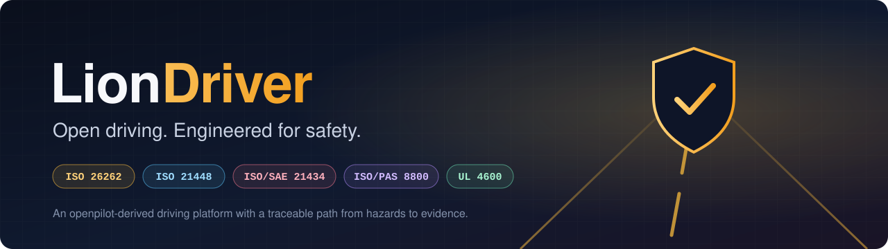
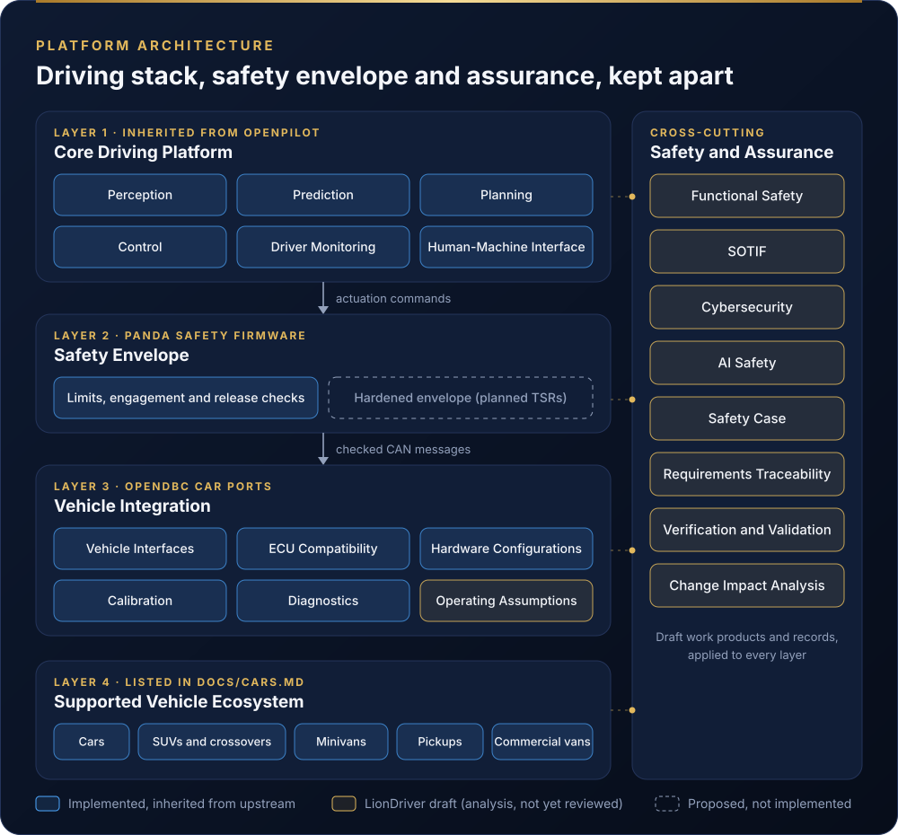
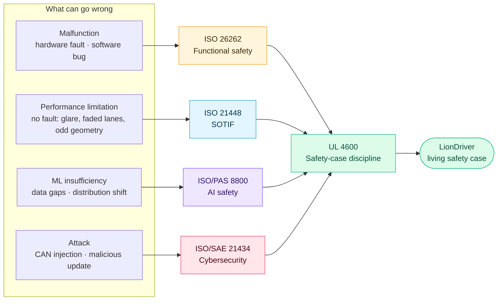
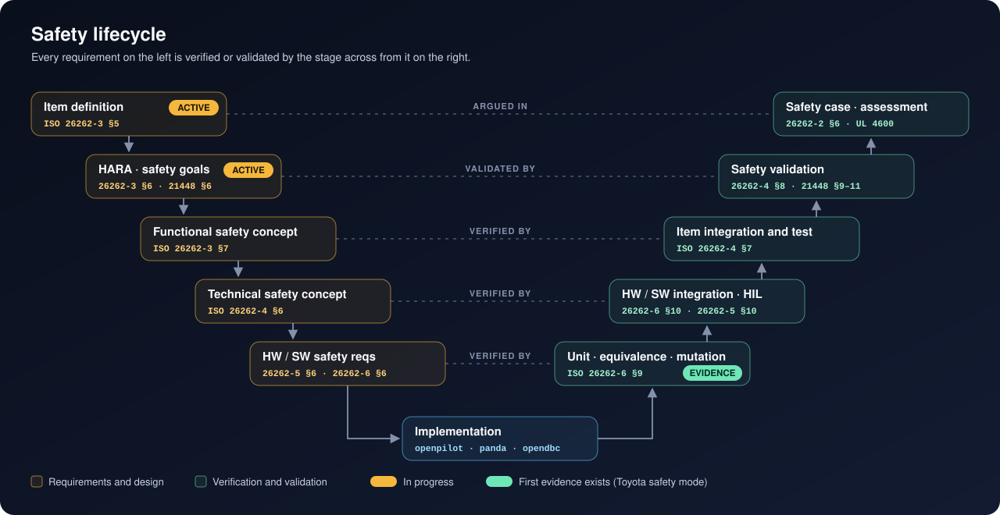
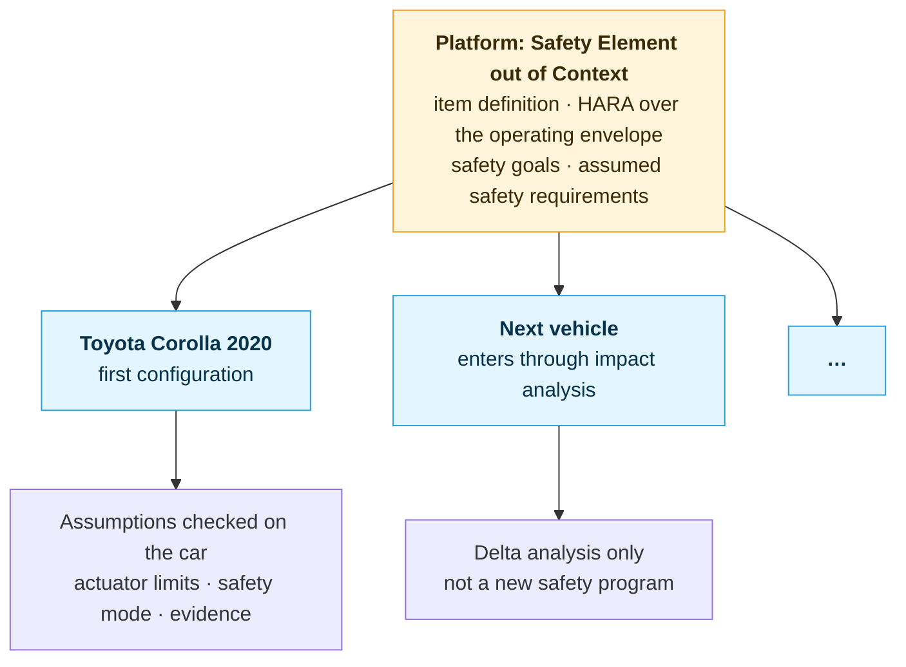
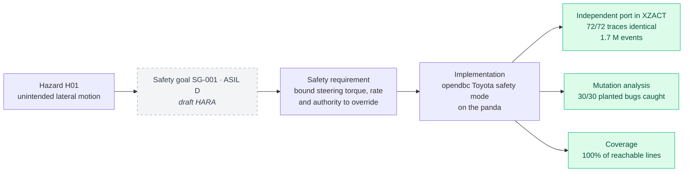

<div align="center">



<br/>

[](#project-status)
[](https://github.com/commaai/openpilot)
[](LICENSE)
[](docs/safety/configurations/toyota-corolla-2020/)

**[Safety framework](docs/safety/)** &nbsp;·&nbsp;
**[How we use the standards](docs/safety/standards.md)** &nbsp;·&nbsp;
**[Architecture](#architecture)** &nbsp;·&nbsp;
**[Lifecycle](#the-safety-lifecycle)** &nbsp;·&nbsp;
**[Roadmap](#roadmap)** &nbsp;·&nbsp;
**[Contributing](#contributing)**

</div>

---

> [!IMPORTANT]
> **LionDriver is research and development software.** It is not safety certified and not approved for unsupervised use on public roads. No claim of ISO 26262 compliance or ASIL capability is made for the current baseline. Every safety claim this project makes is limited to the configurations and evidence that support it.

## Why LionDriver

openpilot is one of the most capable open driver-assistance systems in the world. It runs on hundreds of car models and keeps its most safety-critical logic in a small, carefully tested layer. What it doesn't have is the engineering record that safety-critical automotive products are built on: hazards traced to safety goals, safety goals traced to requirements, and requirements traced to code and evidence, all open to independent review.

**LionDriver builds that record in the open.** It asks what it takes to turn an existing open-source driving system into a rigorously engineered, evidence-backed reference platform, and publishes every step: the analyses, the decisions, the evidence and the gaps.

<table>
<tr>
<td width="33%" valign="top">

### 🧭 Traceable
Every safety goal links down to the requirements that implement it, the code that realizes them and the tests that prove them. When something changes, the trace shows what has to be re-verified.

</td>
<td width="33%" valign="top">

### 🔍 Evidence first
Claims are only as strong as their evidence. We publish test results, coverage, mutation scores and open issues side by side, including the parts that aren't done yet.

</td>
<td width="33%" valign="top">

### 🌐 Built to scale
The platform is analyzed once, as a *Safety Element out of Context*. Each car is a configuration that is checked against the platform's assumptions, so adding a car doesn't mean starting a new safety program.

</td>
</tr>
</table>

## Architecture



LionDriver keeps openpilot's central design choice and builds its safety argument on it: **the doer / checker split.**

| | The doer: openpilot stack | The checker: panda safety layer |
|---|---|---|
| **Job** | Perceive the road, plan a path, compute steering and acceleration commands | Decide which commands may reach the car |
| **Nature** | Large, learned, probabilistic | Small, deterministic, exhaustively testable |
| **Runs on** | Application processor on the comma device | Microcontroller on the vehicle CAN bus |
| **Safety argument** | Performance and insufficiency: ISO 21448, ISO/PAS 8800, UL 4600 | Freedom from malfunction: ISO 26262, integrity level from the HARA |
| **If it fails** | The checker bounds what it can do to the car | The driver can always override; monitoring and redundancy are engineered against it |

The checker enforces actuator limits (torque, rate, angle, acceleration), ends control on brake, gas or cancel, rejects stale or corrupt sensor messages, and refuses all output if the wiring harness relay fails. Because the checker is small, it can carry the strongest evidence. Because it sits between the doer and the car, that evidence covers whatever the doer does.

## How the standards fit together

No single standard covers a driving system. Each one answers a different question about what can go wrong, and LionDriver uses all five together:



| Standard | The question it answers | Where LionDriver applies it | Key work products |
|---|---|---|---|
| **ISO 26262** | What if something *breaks*? | The panda safety layer, interfaces, vehicle integration | Item definition, HARA, safety goals, functional and technical safety concepts, verification |
| **ISO 21448** (SOTIF) | What if nothing breaks but the system still *gets it wrong*? | Perception, planning, the operating envelope | Triggering conditions, scenario catalog, acceptance criteria, validation |
| **ISO/PAS 8800** | How do we trust a *learned* component? | The driving and driver-monitoring models | AI safety requirements, data management, model verification, field monitoring |
| **ISO/SAE 21434** | What if someone *attacks* it? | CAN, USB, updates, cloud | TARA, cybersecurity goals and concept, vulnerability management |
| **UL 4600** | Is the whole argument *convincing*? | The safety case that ties everything together | Structured safety case, safety performance indicators, field feedback |

The full mapping, with clauses, interfaces between standards and what we deliberately leave out, is in **[docs/safety/standards.md](docs/safety/standards.md)**.

## The safety lifecycle



The work follows the ISO 26262 V-model, with SOTIF and AI-safety activities folded into the concept and validation stages. All work products live in **[docs/safety/](docs/safety/)**.

### One platform, many vehicles

openpilot supports hundreds of car models, so a safety analysis tied to one car would never scale. LionDriver analyzes the **platform** once, as a Safety Element out of Context (ISO 26262-10 §9), over a declared operating envelope. Everything that depends on the car (actuator authority, stock safety systems, the brand safety mode) becomes an explicit **assumption**, which each vehicle configuration then checks.



The 2020 Toyota Corolla LE is the first configuration: the car on which every platform assumption is first checked against real hardware.

### From hazard to evidence

The first link in the chain already has evidence behind it. The Toyota safety mode the Corolla runs (in `opendbc_repo`, at the exact commit LionDriver pins) was independently re-implemented in [XZACT](https://github.com/jherrodthomas/XZACT-Lang/tree/claude/admiring-ritchie-hneag0/apps/openpilot_toyota_safety) and checked against the original line for line:



| Evidence | Result |
|---|---|
| Behavioral equivalence, original C vs. independent port | **72 / 72** traces byte-identical, 1,703,142 events |
| Exhaustive sweeps (wheel-speed rounding, angle-rate limits) | identical over the full input range |
| Reachable lines of the upstream safety code executed | **100%** |
| Planted bugs detected by the test traces | **30 / 30** |

## Roadmap

| Phase | Work | Status |
|---|---|---|
| **0 · Foundations** | Governance, repository structure, standards mapping, documentation framework | 🟡 In progress |
| **1 · Concept** | [Safety plan](docs/safety/platform/safety-plan/) · [item definition](docs/safety/platform/item-definition/) · operating envelope · [HARA: 9 safety goals](docs/safety/platform/hara/) | 🟡 Drafts complete, awaiting independent review |
| **2 · Safety concepts** | [Functional safety concept](docs/safety/platform/fsc/) · SOTIF analysis · TARA and cybersecurity goals · AI safety requirements | 🟡 FSC drafted |
| **3 · Architecture** | [Technical safety concept](docs/safety/platform/tsc/) · assessment of existing openpilot software and hardware · gap analysis | 🟡 TSC drafted |
| **4 · Safety mechanisms** | Hardened safety layer · supporting hardware · driver-monitoring requirements | ⚪ Planned |
| **5 · Verification** | Requirements traceability · unit, equivalence and mutation testing · SIL and HIL · fault injection | 🟢 First evidence (Toyota safety mode) |
| **6 · Validation** | Scenario-based validation · controlled track testing · first vehicle configuration | ⚪ Planned |
| **7 · Assurance** | Living safety case · confirmation reviews · independent assessment | ⚪ Planned |

## Repository map

```
liondriver/
├── docs/safety/                 ← the safety framework (start here)
│   ├── README.md                   work-product index, process, change workflow
│   ├── standards.md                how each standard is applied
│   ├── platform/                   platform-level analyses (SEooC)
│   └── configurations/             one folder per vehicle configuration
│       └── toyota-corolla-2020/
├── openpilot/                   driving software (the doer)
├── panda/                       safety-layer firmware (the checker)
├── opendbc_repo/                vehicle interfaces and brand safety modes
├── msgq_repo/ · rednose_repo/ · tinygrad_repo/ · teleoprtc_repo/
└── system/ · tools/ · scripts/  platform services and tooling
```

## Project status

**Research and development. Not safety certified and not approved for unsupervised public-road operation.**

LionDriver makes no claim of ISO 26262 compliance, ASIL capability or suitability for driverless operation for the current baseline. Like openpilot, it is a driver-assistance system: the driver must stay attentive and in control at all times. Safety claims will be limited to the configurations and evidence that support them, and the gaps will be published alongside the evidence.

## Contributing

Contributions, engineering reviews, technical discussion and safety-analysis feedback are welcome, especially from people who have done this work in industry. Changes that touch a safety-related element go through impact analysis and an independent safety review before merge; the workflow is described in **[docs/safety/README.md](docs/safety/README.md#change-workflow)**. Contribution guidelines and review requirements will grow with the project.

## Upstream project

LionDriver is derived from [openpilot](https://github.com/commaai/openpilot), developed by comma.ai and its contributors. Upstream copyright, licensing and attribution requirements continue to apply. LionDriver is an independent engineering initiative and is not affiliated with or endorsed by comma.ai.

## Maintainer

**Jherrod Thomas** · Robotics and safety-critical systems engineering

LionDriver is an open engineering reference: a public demonstration of safety lifecycle development, systems engineering and assurance practice applied to a real automotive software platform.
