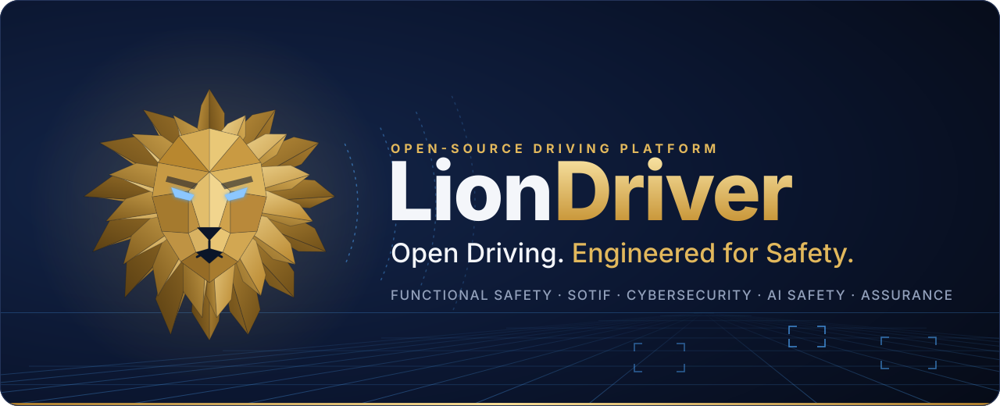
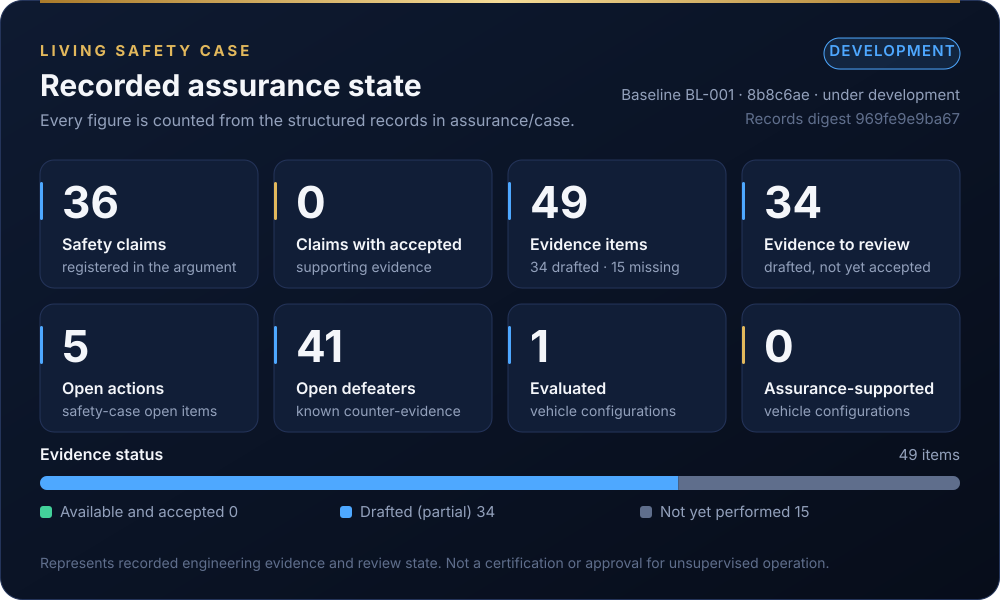
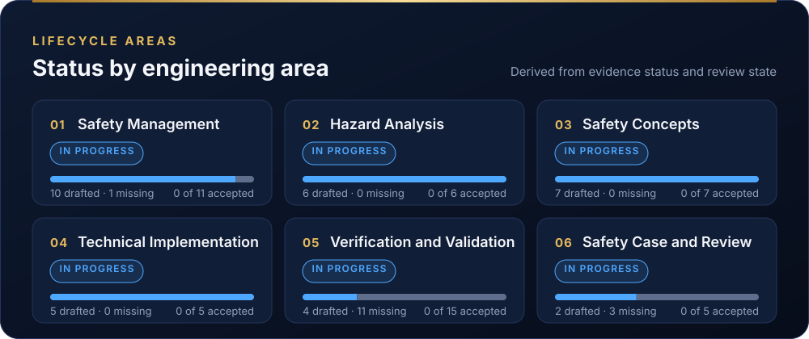
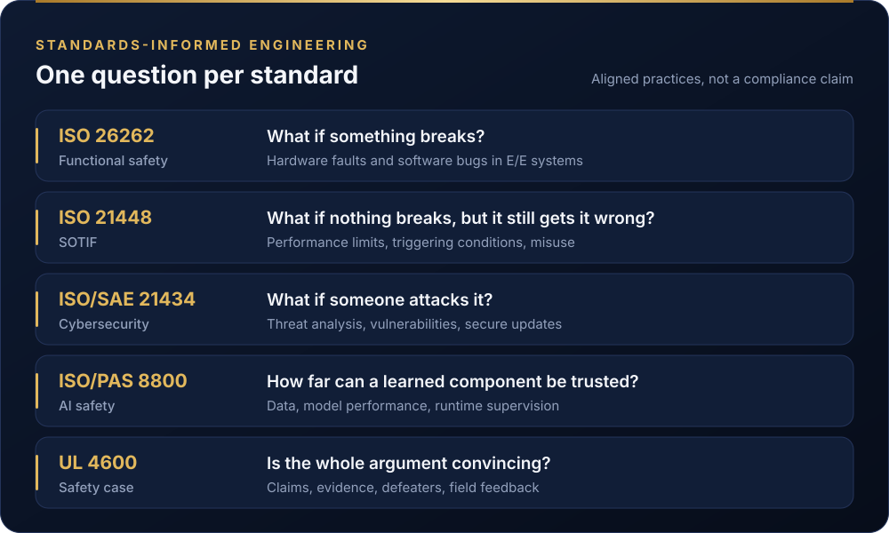
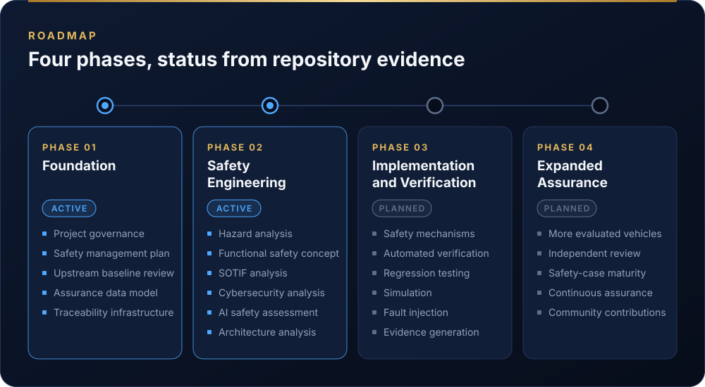

<p align="center">
  
</p>

<p align="center">
  <b>An open-source driving platform derived from openpilot, integrating functional safety, SOTIF, cybersecurity, AI safety, and transparent engineering assurance while preserving broad vehicle compatibility.</b>
</p>

<p align="center">
  <a href="docs/liondriver/README.md">Documentation</a> &nbsp;·&nbsp;
  <a href="#platform-architecture">Architecture</a> &nbsp;·&nbsp;
  <a href="#living-safety-case">Living Safety Case</a> &nbsp;·&nbsp;
  <a href="#300-vehicle-ecosystem">Vehicle Compatibility</a> &nbsp;·&nbsp;
  <a href="#roadmap">Roadmap</a> &nbsp;·&nbsp;
  <a href="#getting-started">Getting Started</a> &nbsp;·&nbsp;
  <a href="#contributing">Contributing</a>
</p>

> [!IMPORTANT]
> **LionDriver is research and development software.** It is a driver-assistance system: the driver must stay attentive and in control at all times. It is not certified, makes no claim of ISO 26262 compliance or ASIL capability, and is not approved for unsupervised operation.

## Living Safety Case

LionDriver publishes its safety argument as it is built: the claims it makes, the evidence for each one, the known counter-evidence against it, and what has and has not been reviewed. The figures below are generated from the structured records in [`assurance/case/`](assurance/case/README.md) and checked by CI on every pull request. Nothing on this card is typed by hand.

<p align="center">
  
</p>

> **Assurance status represents recorded engineering evidence and review state. It does not constitute certification or approval for unsupervised operation.**

<p align="center">
  
</p>

<details>
<summary><b>Recorded values as text</b></summary>

<!-- BEGIN GENERATED: assurance-summary (assurance/case/tools/generate_dashboard.py) -->

| Indicator | Recorded value |
|---|---|
| Assurance state | Development |
| Engineering baseline | `BL-001` at `8b8c6ae` (under development) |
| Registered safety claims | 36 |
| Claims with accepted supporting evidence | 0 |
| Registered evidence items | 49 (0 available, 34 drafted, 15 not yet performed) |
| Evidence requiring review | 34 |
| Open assurance actions | 5 |
| Open defeaters (known counter-evidence) | 41 |
| Evaluated configurations | 1 |
| Assurance-supported configurations | 0 |
| Records digest | `a5a5287e4400` |

| Lifecycle area | Status | Evidence (drafted / missing / accepted) |
|---|---|---|
| Safety Management | In Progress | 11 (10 / 1 / 0) |
| Hazard Analysis | In Progress | 6 (6 / 0 / 0) |
| Safety Concepts | In Progress | 7 (7 / 0 / 0) |
| Technical Implementation | In Progress | 5 (5 / 0 / 0) |
| Verification and Validation | In Progress | 15 (4 / 11 / 0) |
| Safety Case and Review | In Progress | 5 (2 / 3 / 0) |

<!-- END GENERATED: assurance-summary -->

</details>

**Read more:** [full safety case (WP-K-01)](assurance/10-safety-case/WP-K-01-safety-case.md) · [how the figures are computed](assurance/case/README.md#5-dashboard-figures) · [all assurance work products](assurance/README.md) · [known gaps](assurance/00-assessment/gap-assessment.md)

**What the dashboard guarantees:**

- A claim counts as accepted only when a recorded review accepts it, every piece of evidence it cites is available and accepted, and no defeater against it is open. The [validator](assurance/case/tools/validate.py) refuses anything else.
- A passing CI run, a passing test or the existence of a document never accepts a claim on its own, and an AI-generated review is not a substitute for independent confirmation.
- A change to safety-relevant code needs an [impact analysis](assurance/01-management/WP-M-12-impact-analysis.md) that names the assurance records it affects.

## Platform Architecture

<p align="center">
  
</p>

LionDriver keeps openpilot's driving stack and its central safety design: a large, learned driving stack (the doer) whose commands pass through a small, deterministic safety layer on the panda microcontroller (the checker) before they reach the car. LionDriver adds the engineering record around it, and the [gap assessment](assurance/00-assessment/gap-assessment.md) states plainly where the inherited checker does not yet meet what the safety goals require.

| Layer | Role | State |
|---|---|---|
| Core driving platform | Perception, prediction, planning, control, driver monitoring, HMI | Implemented, inherited from openpilot |
| Safety envelope | Actuator limits, engagement and release on driver input, message checks | Implemented, inherited; hardening proposed in the [technical safety requirements](assurance/03-system/WP-S-02-technical-safety-requirements.md) |
| Vehicle integration | Vehicle interfaces, ECU compatibility, hardware configurations, calibration, diagnostics | Implemented, inherited; vehicle operating assumptions drafted |
| Safety and assurance | Functional safety, SOTIF, cybersecurity, AI safety, safety case, traceability, V&V, change impact analysis | Draft work products, not yet reviewed |

More in the [architecture overview](docs/liondriver/architecture.md).

## 300+ Vehicle Ecosystem

LionDriver is built on openpilot's vehicle support and keeps every upstream car port. The pinned upstream version lists **335 car models** in [`docs/CARS.md`](docs/CARS.md), from cars and SUVs to minivans, pickups and light commercial vans. LionDriver is a multi-vehicle platform, not a single-vehicle retrofit.

<p align="center">
  
</p>

> **Vehicle compatibility does not imply independent safety assurance.**

| Classification | Meaning |
|---|---|
| **Upstream Compatible** | Supported by the inherited openpilot integration |
| **LionDriver Evaluated** | Undergoing or completed documented engineering evaluation |
| **Assurance Supported** | Defined configuration with accepted evidence for specific safety claims |

The first evaluated configuration is the 2020 Toyota Corolla LE with Toyota Safety Sense 2.0, the reference vehicle for the assurance work. It is a starting point, not a limit: further vehicles join through a documented impact analysis against the assumptions the analysis makes about the car. No configuration is assurance-supported yet. See [vehicle compatibility](docs/liondriver/compatibility.md).

## Standards and Engineering Framework

<p align="center">
  
</p>

LionDriver follows standards-informed development: its work products are structured after these standards and cite their clauses, but **no compliance is claimed**, because no assessment has been performed. The [assurance strategy](assurance/01-management/WP-M-01-assurance-strategy.md) explains how each one is tailored to an open-source, supervised Level 2 system.

| Supporting practice | Where it is applied |
|---|---|
| Automotive SPICE | [Capability baseline](assurance/01-management/WP-M-13-aspice-capability-baseline.md) |
| Systems engineering and requirements management | [System requirements](assurance/03-system/WP-S-01-system-requirements.md) · [traceability procedure](assurance/07-supporting/WP-P-06-requirements-management-traceability.md) · [trace data](assurance/trace/README.md) |
| Safety analysis | [ASIL decomposition](assurance/08-analyses/WP-A-01-asil-decomposition.md) · [freedom from interference](assurance/08-analyses/WP-A-02-coexistence-freedom-from-interference.md) · [dependent failures](assurance/08-analyses/WP-A-03-dependent-failure-analysis.md) · [FTA/FMEA](assurance/08-analyses/WP-A-04-system-fta-fmea.md) |
| Simulation, SIL and HIL | [Embedded software testing](assurance/05-software/WP-W-08-embedded-software-testing.md) · [SOTIF verification and validation strategy](assurance/06-validation/WP-V-02-sotif-vv-strategy.md) |
| Fault injection | [Fault injection specification](assurance/06-validation/WP-V-05-fault-injection.md) |
| Independent review | [Confirmation measures plan](assurance/01-management/WP-M-06-confirmation-measures-plan.md) · [verification review procedure](assurance/07-supporting/WP-P-05-verification-review-procedure.md) |
| IEC 61508 | Referenced for supplier safety documentation of the safety microcontroller ([component qualification](assurance/04-hardware/WP-H-07-hardware-component-qualification.md)) |

## Roadmap

<p align="center">
  
</p>

Status is taken from what exists in the repository. "Draft" means the work product is written but not reviewed; nothing is marked complete before its review.

| Phase | Work | Status |
|---|---|---|
| **1 · Foundation** | Project governance and [safety management plan](assurance/01-management/WP-M-02-safety-plan.md) | Draft |
| | [Upstream baseline assessment](assurance/00-assessment/gap-assessment.md) | Draft |
| | [Assurance data model](assurance/case/README.md) and [traceability data](assurance/trace/README.md) | Draft; hazards, goals, assumptions and safety case recorded, requirements not yet |
| **2 · Safety Engineering** | [Hazard analysis](assurance/02-concept/WP-C-03-hara.md) and [functional safety concept](assurance/02-concept/WP-C-04-functional-safety-concept.md) | Draft |
| | [SOTIF analysis](assurance/02-concept/WP-C-06-sotif-insufficiencies-triggering-conditions.md), [cybersecurity analysis](assurance/02-concept/WP-C-09-tara.md), [AI safety requirements](assurance/02-concept/WP-C-11-ai-system-definition-and-safety-requirements.md) | Draft |
| | [Architecture analysis](assurance/03-system/WP-S-03-technical-safety-concept-architecture.md) | Draft |
| **3 · Implementation and Verification** | Safety mechanisms from the technical safety requirements | Planned |
| | Automated verification of the inherited safety code (unit tests, coverage gate, MISRA, mutation) | Running in [CI](.github/workflows/safety.yaml); not yet reviewed as evidence |
| | Regression testing, simulation, fault injection, evidence generation | Specified, not executed |
| **4 · Expanded Assurance** | More evaluated configurations, independent review, living safety-case maturity, continuous assurance, community contributions | Planned |

## Getting Started

**For development**, LionDriver uses openpilot's toolchain unchanged (Ubuntu 24.04 or macOS; see [`tools/README.md`](tools/README.md)):

```bash
git clone https://github.com/jherrodthomas/LionDriver.git
cd LionDriver
tools/op.sh setup
source .venv/bin/activate
scons -u
```

**For the assurance records**, only Python 3 is needed:

```bash
python3 assurance/case/tools/validate.py
python3 assurance/case/tools/generate_dashboard.py --check
```

**In a car:** LionDriver publishes no release build. Development builds must not be used on public roads outside the controlled test regime in [WP-V-07](assurance/06-validation/WP-V-07-vehicle-test-operations.md). How openpilot itself is installed and used is described in the [upstream project](https://github.com/commaai/openpilot#using-openpilot-in-a-car).

## Contributing

Contributions are welcome in software, functional safety, SOTIF, cybersecurity, AI safety, verification, documentation and vehicle integration. Safety-relevant changes need a rationale, an impact analysis and appropriate verification.

| | |
|---|---|
| [Contributing to LionDriver](docs/liondriver/contributing.md) | Rules for safety-relevant changes and assurance records |
| [Issues](https://github.com/jherrodthomas/LionDriver/issues) · [Pull requests](https://github.com/jherrodthomas/LionDriver/pulls) | Questions, bugs, reviews of the analyses; pull requests target `liondriver-dev` |
| [Documentation](docs/liondriver/README.md) | Architecture, compatibility, assurance and the inherited openpilot docs |
| [Upstream openpilot](https://github.com/commaai/openpilot) | The driving platform LionDriver is derived from |

## Maintainer and Upstream Attribution

**Jherrod Thomas** maintains LionDriver as an open engineering initiative: a public demonstration of safety-lifecycle development, systems engineering and assurance practice on a real automotive software platform.

LionDriver is derived from [openpilot](https://github.com/commaai/openpilot) by [comma.ai](https://comma.ai) and its contributors, and builds on their work. openpilot is released under the [MIT license](LICENSE); its copyright, licence and attribution notices continue to apply. LionDriver is an independent project and is not affiliated with or endorsed by comma.ai.
