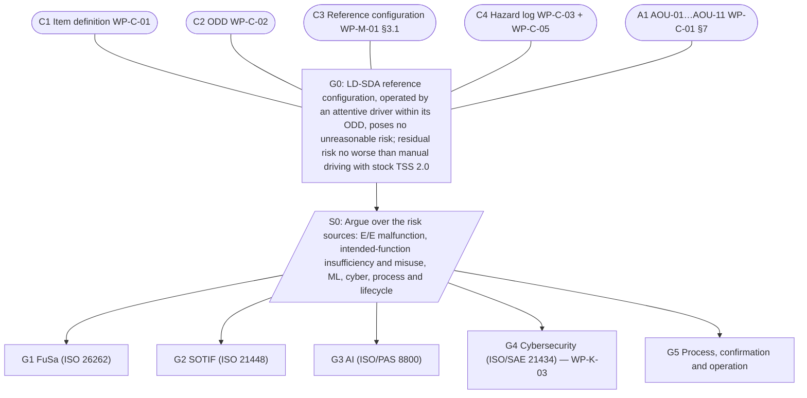

# WP-K-01 Safety Case

| Field | Value |
|---|---|
| Work product | WP-K-01 Safety case (integrated functional safety, SOTIF and AI argument; links to the cybersecurity case) |
| Standard reference | ISO 26262-2:2018 §6 (safety case); ISO 21448:2022 §12 (via [WP-K-02](WP-K-02-sotif-release-argument.md)); ISO/PAS 8800:2024 (AI assurance argument); ISO/SAE 21434:2021 §6 (cybersecurity case, via [WP-K-03](WP-K-03-cybersecurity-case.md)); UL 4600 (informative only, see §8); GSN Community Standard (notation) |
| Version | 0.1 |
| Status | Draft — **living document. At this baseline the argument structure is defined; almost all evidence is missing or partial. This safety case does not support any release or public-road claim** |
| ASIL / scope | Item LD-SDA, reference configuration; up to ASIL C (SG-01) |
| Author | Assurance team (initial draft) |
| Reviewer(s) | TBD (I1); confirmation review CR-12 by external assessor (I3) per [WP-M-06](../01-management/WP-M-06-confirmation-measures-plan.md) |
| Approver | Safety manager |
| Baseline | `8b8c6ae` |

## 1. Purpose

This is the argument that the LionDriver reference configuration is acceptably safe, built on the top-level claim **G0** of [WP-M-01 §3.2](../01-management/WP-M-01-assurance-strategy.md#32-top-level-claim) and its five sub-claims G1–G5. It is built incrementally per [WP-M-02 §11](../01-management/WP-M-02-safety-plan.md#11-safety-case-planning):

| Gate | Expected state of this document |
|---|---|
| G1 (this version's target) | Argument structure; contexts and assumptions; evidence slots linked to planned work products; defeaters stated |
| G2 | Envelope argument (TSC, FFI, DFA) with architecture evidence |
| G3–G4 | Verification and qualification evidence linked; residual gaps as defeaters or assumptions |
| G5 | Complete; input to the functional safety assessment ([WP-K-04](WP-K-04-functional-safety-assessment.md)) and the release record ([WP-K-06](WP-K-06-release-record.md)) |

Rules applied ([WP-M-02 §11](../01-management/WP-M-02-safety-plan.md#11-safety-case-planning)): every solution points to evidence that exists in the repository at a named baseline, or is shown as missing; known weaknesses are stated as defeaters, not omitted.

## 2. Notation

GSN elements are written as text with these prefixes. Each element has a stable ID; IDs are never reused.

| Prefix | GSN element | Meaning |
|---|---|---|
| `G` | Goal | A claim |
| `S` | Strategy | How a claim is broken down |
| `C` | Context | Scope, definitions, referenced artefacts |
| `A` | Assumption | Stated without proof inside this argument (here: AoUs and design assumptions) |
| `J` | Justification | Why a strategy or claim is reasonable |
| `Sn` | Solution | Evidence item (work product, test report, analysis result) |
| `DF` | Defeater | Known counter-evidence that currently undermines a claim (UL 4600-style, informative) |
| ◇ | Undeveloped | Claim not yet broken down further |

Indented trees show "supported by" (→) and "in context of" (⊙) relations. The evidence status of each `Sn` is in §6; defeaters are in §7.

## 3. Top level



### 3.1 G0 and its context

```text
G0  The LionDriver reference configuration, operated by an attentive driver within its
    ODD, does not pose unreasonable risk to vehicle occupants or other road users. The
    residual risk is no worse than manual driving of the same vehicle with its stock
    TSS 2.0 driver assistance.                                   [WP-M-01 §3.2]
 ⊙ C1   Item definition: functions F-01…F-09, elements E-01…E-06, interfaces IF-01…IF-09
        [WP-C-01]
 ⊙ C2   ODD and intended functionality [WP-C-02]
 ⊙ C3   Reference configuration: 2020 Corolla LE ICE TSS2 (TOYOTA_COROLLA_TSS2), one
        recorded device revision + Toyota harness, tagged LionDriver release
        [WP-M-01 §3.1; WP-O-01 SPC-04…SPC-07]
 ⊙ C4   Hazard log: H-01…H-06, H-08; HE-01.1…HE-08.1; SG-01…SG-07 [WP-C-03];
        SH-01…SH-13 [WP-C-05]; TARA damage scenarios [WP-C-09]
 ⊙ C5   Safety envelope architecture pattern: QM SoC stack bounded by the opendbc safety
        mode on the panda MCU [WP-M-01 §4.1]
 ⊙ C6   Tailoring T-01…T-13 [WP-M-01 §5]
 ⊙ A1   AOU-01…AOU-11 hold [WP-C-01 §7] — see §5 for status
 ⊙ J0   "No worse than manual driving with stock TSS 2.0" is the acceptance principle
        because LD-SDA replaces stock LTA and DRCC; the comparison baseline is what the
        driver would otherwise have. Quantified in WP-C-05 §5 and WP-V-02
 → S0   Argue over each source of risk, one sub-claim per discipline
     → G1, G2, G3, G4, G5
```

## 4. Sub-arguments

### 4.1 G1 Functional safety

```text
G1  Hazards from E/E malfunctions of the item are reduced to a tolerable level: every
    safety goal SG-01…SG-07 is met with the integrity of its ASIL.
 ⊙ C4 (safety goals and ASILs, WP-C-03 §6)
 ⊙ C7   Envelope strategy: reduced authority (option c) + ASIL B hardening, recommended
        and pending maintainer decision [WP-C-04 §4]
 → S1   Argue per safety goal, then over the properties every SG depends on
     → G1.1  SG-01 (lateral motion, ASIL C ⚠ / B if C1 shown under option c) is met
          → S1.1 Argue over (i) envelope limits keep any command controllable,
                 (ii) the limits are enforced by an element of sufficient integrity,
                 (iii) faults of the enforcing element are detected and reacted to in FTTI
              → G1.1.1 Envelope limits (torque magnitude, rate, measured tracking)
                        are controllable by a typical driver (C1 basis)
                   → Sn-01 FSR-01.x [WP-C-04 §5.1]; Sn-20 vehicle controllability test
                           (steering-force / lateral deviation at limits) [WP-V-01]
                   ⊙ A: AOU-01, AOU-02
              → G1.1.2 Limits are enforced on every TX frame by the Toyota safety mode
                   → Sn-02 TSR-1xx [WP-S-02]; Sn-03 SWSR-1xx [WP-W-02];
                     Sn-10 opendbc safety unit tests + MISRA + mutation [WP-W-06];
                     Sn-12 HIL tests [WP-W-08]
              → G1.1.3 No steering actuation while not engaged
                   → Sn-10 (`lateral.h:98-101` tests); Sn-12
              → G1.1.4 Envelope faults (MCU hang, SPI corruption, wrong safety mode,
                        stale RX) reach the safe state within the FTTI
                   → Sn-04 FTTI budget [WP-S-04]; Sn-13 fault injection [WP-V-05]
                   ⇐ DF-01, DF-02, DF-03, DF-04, DF-05, DF-06
     → G1.2  SG-02 (lateral loss without warning, B) is met
          → Sn-01 FSR-02.x; Sn-02 TSR-6xx; Sn-14 SW integration tests [WP-W-07];
            Sn-13 fault injection
          ⇐ DF-07 (soft-disable 3 s actuation), DF-08 (diagnostics masked)
     → G1.3  SG-03 (unintended acceleration, B ⚠) is met
          → Sn-01 FSR-03.x; Sn-02 TSR-2xx; Sn-10; Sn-12; Sn-21 PCM envelope test (AOU-05)
     → G1.4  SG-04 (excessive deceleration, B ⚠) is met
          → Sn-01 FSR-04.x; Sn-02 TSR-2xx; Sn-21
          ⇐ DF-09 (no jerk limit in envelope)
     → G1.5  SG-05 (release on driver action, B ⚠) is met
          → Sn-01 FSR-05.x; Sn-02 TSR-3xx; Sn-10 (brake/PCM tests, `common.py`);
            Sn-22 brake override test (AOU-03)
          ⇐ DF-10 (no driver-torque monitoring in envelope)
     → G1.6  SG-06 (longitudinal loss without warning, B) is met
          → Sn-01 FSR-06.x; Sn-14; Sn-13
     → G1.7  SG-07 (stock PCS preserved, B) is met
          → Sn-01 FSR-07.x; Sn-02 TSR-7xx; Sn-23 PCS target test (AOU-04);
            Sn-30 installation check INS-27 [WP-O-01]
          ⇐ DF-11 (relay detection traffic-based only)
     → G1.8  The QM SoC stack cannot interfere with the envelope (FFI)
          → Sn-05 coexistence/FFI analysis [WP-A-02]; Sn-06 DFA [WP-A-03]
          ⇐ DF-03 (host sets safety mode), DF-12 (debug relay command)
     → G1.9  Random hardware failures of the panda MCU, relay, power and harness are
             sufficiently controlled for the target ASIL
          → Sn-07 FMEDA [WP-H-03]; Sn-08 metrics [WP-H-04]; Sn-09 PMHF/EEC [WP-H-05];
            Sn-11 HW component qualification [WP-H-07]
          ⇐ DF-04 (report-only faults), DF-13 (no FMEDA, no supplier data)
     → G1.10 The assumptions credited in controllability (AOU-01/02/03/05) are verified
          → Sn-20, Sn-21, Sn-22 vehicle characterisation [WP-V-01]
          ⇐ DF-14 (all AoUs unverified)
```

### 4.2 G2 SOTIF

The detailed SOTIF release argument is [WP-K-02](WP-K-02-sotif-release-argument.md). This branch carries its top claims.

```text
G2  Hazards from functional insufficiencies of the intended functionality and from
    reasonably foreseeable misuse are acceptably low.
 ⊙ C8   SOTIF hazards SH-01…SH-13, acceptance criteria AC-01…AC-06 [WP-C-05]
 ⊙ C9   Validation targets [WP-V-02]
 → S2   Argue over known hazardous scenarios, unknown hazardous scenarios, and misuse;
        then over residual risk against the acceptance criteria   [21448 §9–12]
     → G2.1 Known triggering conditions and insufficiencies are identified and each is
            acceptable, mitigated by a functional modification, or excluded from the ODD
          → Sn-40 insufficiency/TC analysis [WP-C-06]; Sn-41 functional modifications
            [WP-C-07]; Sn-42 known-scenario evaluation [WP-V-03]
          ⇐ DF-15 (Experimental Mode default), DF-08 (Chestnut masking)
     → G2.2 The residual risk from unknown hazardous scenarios is below the validation
            targets
          → Sn-43 unknown-scenario evaluation [WP-V-04]; Sn-44 field monitoring
            [WP-O-04]
          ⇐ DF-16 (no fork-owned driving data, no replay capability)
     → G2.3 Foreseeable misuse is detected or prevented to the extent the
            controllability ratings assume
          → Sn-45 misuse analysis [WP-C-08]; Sn-46 DM performance tests; Sn-47 user
            information and briefing [WP-O-03]
          ⊙ A: AOU-06, AOU-07
          ⇐ DF-17 (DM validity hard-coded, wheel-touch reset), DF-18 (DM demo param)
     → G2.4 Every actuation of the intended function stays within an envelope whose
            controllability is demonstrated (link to G1.1.1)      [AC-02]
```

### 4.3 G3 AI

```text
G3  The ML components (driving model, DM model) are adequately specified, developed,
    validated and monitored for their role in the architecture.
 ⊙ C10  AI system definition and AI safety requirements AIR-nn [WP-C-11]
 ⊙ J3   Models are QM components inside the envelope; their errors are SOTIF
        insufficiencies (G2) and their worst-case actuation is bounded by G1.1
 → S3   Argue over model identity, input-space/ODD fit, performance evidence, runtime
        supervision, and change control
     → G3.1 The deployed models are exactly the validated ones
          → Sn-50 model hash pinning in release record [WP-K-06]; Sn-31 INS-18
          ⇐ DF-19 (no hash/signature check at load; pickle deserialisation)
     → G3.2 The models' input space covers the ODD
          → Sn-51 dataset/ODD analysis [WP-W-10]
          ⇐ DF-20 (training data and its ODD unavailable to LionDriver)
     → G3.3 Model performance meets AIR targets in the ODD
          → Sn-52 model test reports [WP-W-10]; Sn-42
     → G3.4 Out-of-distribution or degraded model behaviour is detected or bounded
          → Sn-53 runtime supervision design [WP-C-11]; G1.1 (bounded actuation)
          ⇐ DF-21 (no uncertainty/OOD gating of the action)
     → G3.5 Model changes are controlled (D-05)
          → Sn-60 change management [WP-P-02]; Sn-54 AI safety plan [WP-M-10]
```

### 4.4 G4 Cybersecurity

```text
G4  Cybersecurity risks that can affect safety (and privacy) are treated.
 → see Cybersecurity case [WP-K-03]; TARA [WP-C-09]; goals [WP-C-10]
 Interface to G1: attacks that cause H-01…H-08 are covered by CSGs that protect the SGs.
 ⇐ DF-22 (RSA-1024/SHA-1 panda signing, committed debug key, debug default builds)
 ⇐ DF-23 (unsigned git OTA; broad athena RPC surface)
```

### 4.5 G5 Process, confirmation and operation

```text
G5  The work was done by competent people under controlled processes, was
    independently confirmed, and the claims stay valid in operation.
 → S5   Argue over planning, configuration and change control, verification and
        review, competence and independence, confirmation measures, tools and reused
        components, and operation-phase processes
     → G5.1 Plans exist and are followed     → Sn-60 WP-M-01…M-13
     → G5.2 Safety-relevant code and evidence are under LionDriver configuration and
            change control                   → Sn-61 WP-P-01, WP-P-02; Sn-62 baseline
                                               manifest
          ⇐ DF-24 (submodules resolve to upstream; no tags; no branch protection)
     → G5.3 Requirements are traceable from SG to code and test
          → Sn-63 WP-P-06; trace data [WP-T-01]; trace check report
          ⇐ DF-25 (no requirement tags in code or tests)
     → G5.4 Verification reviews and confirmation measures were performed at the
            required independence      → Sn-64 review records [WP-P-05];
                                         Sn-65 confirmation reviews CR-01…CR-12,
                                         FSA [WP-M-06, WP-K-04]
          ⇐ DF-26 (single maintainer; no assessor engaged)
     → G5.5 Tools and reused software components are qualified
          → Sn-66 [WP-P-07]; Sn-67 [WP-P-08]
     → G5.6 Installation, operation, service, decommissioning and field monitoring
            keep the reference configuration and the AoUs valid
          → Sn-30 [WP-O-01]; Sn-32 [WP-O-02]; Sn-47 [WP-O-03]; Sn-44 [WP-O-04];
            Sn-68 [WP-O-05]
     → G5.7 No public-road operation happened outside the controlled test regime
          → Sn-69 vehicle test operations and records [WP-V-07]
```

## 5. Assumptions

| ID | Assumption | Credited by | Status at baseline | Effect if false |
|---|---|---|---|---|
| AOU-01 | EPS limits LKA torque; ends torque on message loss | G1.1, G1.5, G1.10 | Unverified | HE-01.x C3 → SG-01 ASIL D; G1.1 fails as argued |
| AOU-02 | Driver can overpower full LKA torque | G1.1, G1.5 | Unverified | As AOU-01 |
| AOU-03 | Brake always brakes; PCM cancels ACC on brake | G1.5 | Unverified | SG-05 ASIL C |
| AOU-04 | Stock PCS keeps full function | G1.7 | Unverified | SG-07 violated by design |
| AOU-05 | PCM bounds ACC requests | G1.3, G1.4 | Unverified | SG-03/SG-04 ASIL C |
| AOU-06 | Attentive, briefed driver | G2.3, all C ratings | Assumption (SOTIF-managed) | Controllability basis of all ratings |
| AOU-07 | Only trained safety drivers in development | G5.7 | Not started | Development testing not controlled |
| AOU-08 | Device mounted and calibrated per instructions | G2 | Partial (calibration check exists) | SOTIF insufficiency |
| AOU-09 | Vehicle maintained, unmodified, no DTCs | All | Not started | Any |
| AOU-10 | VSC/ABS on and working | G1.4 | Not started | HE-04.2 rating |
| AOU-11 | Back end untrusted; no safety function depends on it | G4 | Design constraint | — |

Status values are copied from [WP-C-01 §7](../02-concept/WP-C-01-item-definition.md) (machine-readable copy: `trace/items/aou.yaml`).

## 6. Evidence status

Status legend: **Available** = artefact exists, its activity was performed, and it was verified/approved at a named baseline; **Partial** = artefact exists as a draft, or inherited evidence exists that has not been produced or re-run under LionDriver control; **Missing** = no artefact.

| Sn | Evidence | Work product / source | Supports | Status | Note |
|---|---|---|---|---|---|
| Sn-01 | Functional safety requirements FSR-01.01…FSR-07.05 | [WP-C-04](../02-concept/WP-C-04-functional-safety-concept.md) | G1.x | Partial | Draft; envelope strategy decision open |
| Sn-02 | Technical safety requirements | [WP-S-02](../03-system/WP-S-02-technical-safety-requirements.md) | G1.x | Partial | Draft: TSR-101…TSR-818 (incl. TSR-517…519, 619, 620 added in the consistency pass); not reviewed |
| Sn-03 | Software safety requirements | [WP-W-02](../05-software/WP-W-02-software-safety-requirements.md) | G1.1.2 | Partial | Draft in preparation; not reviewed |
| Sn-04 | FTTI and timing budget | [WP-S-04](../03-system/WP-S-04-timing-ftti-budget.md) | G1.1.4 | Partial | Draft: kinematic estimates only, no measurement |
| Sn-05 | FFI analysis | [WP-A-02](../08-analyses/WP-A-02-coexistence-freedom-from-interference.md) | G1.8 | Partial | Draft analysis; not reviewed |
| Sn-06 | Dependent failure analysis | [WP-A-03](../08-analyses/WP-A-03-dependent-failure-analysis.md) | G1.8 | Partial | Draft analysis; audio-path independence (DFI-23) open |
| Sn-07 | Hardware FMEDA | [WP-H-03](../04-hardware/WP-H-03-hardware-safety-analysis-fmeda.md) | G1.9 | Partial | Draft qualitative FMEA; quantitative FMEDA is a template |
| Sn-08 | Hardware architectural metrics | [WP-H-04](../04-hardware/WP-H-04-hardware-metrics.md) | G1.9 | Partial | Method and plan only; no metric computed |
| Sn-09 | Random HW failure evaluation | [WP-H-05](../04-hardware/WP-H-05-random-hardware-failures-pmhf.md) | G1.9 | Partial | Method and plan only; no value computed |
| Sn-10 | opendbc safety unit tests (100% line coverage gate, MISRA, mutation, UBSan) | `opendbc_repo/opendbc/safety/tests/` (`test.sh:36-43`, `misra/test_misra.sh`, `mutation.py`); report in [WP-W-06](../05-software/WP-W-06-software-unit-verification.md) | G1.1.2, G1.1.3, G1.3, G1.5 | Partial | Inherited; not requirement-based; line coverage only; host x86 not target; results not yet produced in LionDriver-controlled CI at a recorded baseline (U-6) |
| Sn-11 | HW component qualification | [WP-H-07](../04-hardware/WP-H-07-hardware-component-qualification.md) | G1.9 | Partial | Qualification plan only; no qualification performed |
| Sn-12 | HIL tests of the envelope | [WP-W-08](../05-software/WP-W-08-embedded-software-testing.md) | G1.1.2, G1.3 | Partial | Specification in preparation; no HIL in the fork (GAP-30); not executed |
| Sn-13 | Fault injection | [WP-V-05](../06-validation/WP-V-05-fault-injection.md) | G1.1.4, G1.2, G1.6 | Partial | Specification drafted; not executed |
| Sn-14 | SW integration / process replay | [WP-W-07](../05-software/WP-W-07-software-integration-verification.md) | G1.2, G1.6 | Partial | Inherited process replay; references fetched from comma storage (GAP-30) |
| Sn-20 | Vehicle controllability and EPS characterisation (AOU-01/02) | [WP-V-01](../06-validation/WP-V-01-safety-validation.md) | G1.1.1, G1.10 | Partial | Test specified (WP-V-01); not executed |
| Sn-21 | PCM ACC envelope test (AOU-05) | WP-V-01 | G1.3, G1.4, G1.10 | Partial | Test specified (WP-V-01); not executed |
| Sn-22 | Brake override test (AOU-03) | WP-V-01 | G1.5, G1.10 | Partial | Test specified (WP-V-01); not executed |
| Sn-23 | Stock PCS target test (AOU-04) | WP-V-01 | G1.7 | Partial | Test specified (WP-V-01); not executed |
| Sn-30 | Installation and provisioning control; installation records | [WP-O-01](../09-production-operation/WP-O-01-installation-and-provisioning-control.md) | G1.7, G5.6 | Partial | Procedure drafted; no installation record yet |
| Sn-31 | Model hash check at installation (INS-18) | WP-O-01 | G3.1 | Partial | Procedure only |
| Sn-32 | Operation, service, decommissioning | [WP-O-02](../09-production-operation/WP-O-02-operation-service-decommissioning.md) | G5.6 | Partial | Draft |
| Sn-40 | Insufficiencies and triggering conditions | [WP-C-06](../02-concept/WP-C-06-sotif-insufficiencies-triggering-conditions.md) | G2.1 | Partial | Draft: FI-01…FI-22, TC-01…TC-33 |
| Sn-41 | Functional modifications | [WP-C-07](../02-concept/WP-C-07-sotif-functional-modifications.md) | G2.1 | Partial | Draft: FM-01…FM-11 decided, none implemented |
| Sn-42 | Known-scenario evaluation | [WP-V-03](../06-validation/WP-V-03-sotif-known-scenarios.md) | G2.1, G3.3 | Partial | Specification drafted (KS-01…KS-26); not executed |
| Sn-43 | Unknown-scenario evaluation | [WP-V-04](../06-validation/WP-V-04-sotif-unknown-scenarios.md) | G2.2 | Partial | Method drafted; not executed |
| Sn-44 | Field monitoring | [WP-O-04](../09-production-operation/WP-O-04-field-monitoring.md) | G2.2, G5.6 | Partial | Process drafted; no LionDriver data path |
| Sn-45 | Misuse analysis | [WP-C-08](../02-concept/WP-C-08-driver-hmi-misuse-analysis.md) | G2.3 | Partial | Draft; controllability tests (CA-01…CA-07) not performed |
| Sn-46 | DM performance tests | WP-V-03 / WP-W-10 | G2.3 | Partial | 13 inherited scenario tests (`selfdrive/monitoring/test_monitoring.py`); none for data loss (GAP-21) |
| Sn-47 | User information and briefing | [WP-O-03](../09-production-operation/WP-O-03-user-information-safety-warnings.md) | G2.3, G5.6 | Partial | Draft text; effectiveness not shown |
| Sn-48 | SOTIF hazards and acceptance criteria | [WP-C-05](../02-concept/WP-C-05-sotif-hazard-identification.md) | G2 (C8) | Partial | Draft |
| Sn-49 | Hazard analysis and risk assessment | [WP-C-03](../02-concept/WP-C-03-hara.md) | G0 (C4), G1 | Partial | Draft; ratings proposals; CR-02 (I3) not done |
| Sn-50 | Model hashes in release record | [WP-K-06](WP-K-06-release-record.md) | G3.1 | Missing | Skeleton only |
| Sn-51 | Dataset / ODD coverage analysis | [WP-W-10](../05-software/WP-W-10-ml-engineering.md) | G3.2 | Partial | Draft engineering plan; training data not available to LionDriver (DF-20) |
| Sn-52 | Model test reports | WP-W-10 | G3.3 | Partial | Test specification (VS-ML-nn) drafted; not executed |
| Sn-53 | AI runtime supervision design, AIR-nn | [WP-C-11](../02-concept/WP-C-11-ai-system-definition-and-safety-requirements.md) | G3.4 | Partial | Draft AIR-nn; monitors not implemented (GAP-22) |
| Sn-54 | AI safety plan | [WP-M-10](../01-management/WP-M-10-ai-safety-plan.md) | G3.5 | Partial | Draft |
| Sn-55 | Item definition | [WP-C-01](../02-concept/WP-C-01-item-definition.md) | G0 (C1) | Partial | Draft; vehicle and device records missing (OI-1/OI-2) |
| Sn-56 | ODD specification | [WP-C-02](../02-concept/WP-C-02-odd-and-intended-functionality.md) | G0 (C2) | Partial | Draft |
| Sn-60 | Management plans | WP-M-01…WP-M-13 | G5.1, G3.5 | Partial | Drafts; not approved; CR-03 not done |
| Sn-61 | CM and change management | [WP-P-01](../07-supporting/WP-P-01-configuration-management-plan.md), [WP-P-02](../07-supporting/WP-P-02-change-management.md) | G5.2 | Partial | Plans drafted; not implemented (no forks, tags, CODEOWNERS) |
| Sn-62 | Baseline manifest | WP-P-01 §8 | G5.2 | Missing | Generator not written |
| Sn-63 | Traceability procedure and data, trace check report | [WP-P-06](../07-supporting/WP-P-06-requirements-management-traceability.md), [WP-T-01](../trace/README.md) | G5.3 | Partial | Procedure drafted; trace data holds only hazards, SGs, AoUs |
| Sn-64 | Verification review records | [WP-P-05](../07-supporting/WP-P-05-verification-review-procedure.md) | G5.4 | Missing | No reviews performed |
| Sn-65 | Confirmation reviews, audit, FSA | [WP-M-06](../01-management/WP-M-06-confirmation-measures-plan.md), [WP-K-04](WP-K-04-functional-safety-assessment.md) | G5.4 | Missing | None performed; no assessor (D-06) |
| Sn-66 | Tool qualification | [WP-P-07](../07-supporting/WP-P-07-tool-classification-qualification.md) | G5.5 | Partial | Classification drafted |
| Sn-67 | SW component qualification | [WP-P-08](../07-supporting/WP-P-08-software-component-qualification.md) | G5.5 | Partial | Draft |
| Sn-68 | CS incident response and updates | [WP-O-05](../09-production-operation/WP-O-05-cybersecurity-incident-response-updates.md) | G4, G5.6 | Partial | Process drafted; not running (GAP-28) |
| Sn-69 | Vehicle test operations and records | [WP-V-07](../06-validation/WP-V-07-vehicle-test-operations.md) | G5.7 | Partial | Procedure drafted; no drive records yet |
| Sn-70 | Cybersecurity case | [WP-K-03](WP-K-03-cybersecurity-case.md) | G4 | Partial | Draft argument; almost all CS evidence Missing or Partial |

Summary at `8b8c6ae` (re-synced with the work-product files in the consistency pass): **Available 0, Partial 45, Missing 4** (49 evidence items). Most Partial items are drafts or specifications whose activity has not been performed; no work product is approved, so nothing is Available. No claim G1–G5 is supported.

## 7. Defeaters (counter-evidence)

Each defeater is a known fact that, while it stands, defeats the claim it is attached to. A defeater is closed only by evidence that removes it (a change plus verification), or by a changed claim with rationale. Sources are the [gap assessment](../00-assessment/gap-assessment.md) findings.

| DF | Counter-evidence | GAP | Undermines | Closure route |
|---|---|---|---|---|
| DF-01 | Hardware watchdog (IWDG) never initialised; SW watchdog checked from the ISR it supervises | GAP-07 | G1.1.4, G1.9 | TSR-5xx; WP-H-01 |
| DF-02 | Detection times (RX ≤ 2 s, heartbeat 3–5 s) exceed the preliminary SG-01 FTTI (≤ 0.5 s) | GAP-06 | G1.1.4 | WP-S-04, TSR-4xx/5xx |
| DF-03 | QM host sets the safety mode and parameter at any time, unauthenticated (`0xdc`) | GAP-09 | G1.8, G1.1.2 | Safety-mode lock (TSR-5xx) |
| DF-04 | Faults are report-only (`PERMANENT_FAULTS = 0U`); no MPU, no RAM ECC handling | GAP-08 | G1.1.4, G1.9 | TSR-5xx |
| DF-05 | No E2E alive counters on any Toyota RX message; brake and wheel speed have no checksum | GAP-01 | G1.1.4, G1.5 | TSR-4xx |
| DF-06 | Weak SoC↔panda integrity (8-bit XOR, no sequence counter); heartbeat proves `pandad` alive, not the control loop | GAP-10 | G1.1.4, G1.8 | TSR-4xx |
| DF-07 | Soft disable keeps actuating up to 3 s on failed inputs (≈ 3.5 s with stale data) | GAP-16 | G1.2, G1.6, G2.1 | WP-C-07, TSR-6xx |
| DF-08 | Diagnostics masked during big-model fallback; cold model hot-switch while actuating | GAP-17 | G1.2, G2.1, G3.4 | Exclude Chestnut (WP-C-01 OI-4) |
| DF-09 | No longitudinal jerk limit in the envelope | GAP-04 | G1.4 | TSR-2xx |
| DF-10 | Envelope does not monitor driver steering torque; override relies on EPS + QM host | GAP-02 | G1.5 | FSR-05.x / TSR-3xx |
| DF-11 | Relay failure detected only by traffic observation, 1–2 s grace, no readback | GAP-12 | G1.7 | HWSR / TSR-7xx |
| DF-12 | Debug relay-drive command `0xc5` not gated in release builds | GAP-09 | G1.7, G1.8 | Firmware change |
| DF-13 | No FMEDA/SPFM/LFM/PMHF; no supplier safety data for the COTS device | GAP-15 | G1.9 | WP-H-03…H-07 |
| DF-14 | All vehicle AoUs (AOU-01…05) unverified; ⚠ ratings may rise to ASIL C/D | GAP-05 | G1.1, G1.3–G1.5, G1.7, G1.10 | Vehicle characterisation |
| DF-15 | Experimental Mode (end-to-end longitudinal) on by default, without hazard assessment | GAP-18 | G2.1, G3 | D-08; WP-C-07 |
| DF-16 | No fork-owned HIL, on-road or model-replay verification; replay references from comma | GAP-30 | G1.1.2, G2.2, G3.3 | D-04 |
| DF-17 | DM validity hard-coded `True`; wheel-touch awareness reset by any input; no tests for DM data loss | GAP-21 | G2.3 | WP-C-08; TSR-6xx |
| DF-18 | Parameters and IPC can change safety behaviour unauthenticated (debug modes, DM demo mode, maneuver plan override) | GAP-20 | G1.8, G2.3 | WP-A-02; configuration lock |
| DF-19 | No model hash/signature check at load; models deserialised with `pickle` | GAP-22 | G3.1, G4 | WP-W-10, WP-S-07 |
| DF-20 | Training data and its ODD are not available to LionDriver | GAP-22 | G3.2 | Argue via G2/G1 bounding; own test data |
| DF-21 | No uncertainty or OOD gating of the control action | GAP-22 | G3.4 | AIR-nn |
| DF-22 | Panda firmware signing RSA-1024/SHA-1; committed debug key; DEBUG default builds | GAP-24, GAP-25 | G4, G1.8 | WP-S-07 |
| DF-23 | Unsigned git-based OTA; broad remote RPC surface | GAP-26, GAP-27 | G4 | WP-O-05 |
| DF-24 | Safety code not under LionDriver CM (submodules resolve to upstream; tinygrad on master) | GAP-29, GAP-37 | G5.2 | D-01, D-02 |
| DF-25 | No requirement IDs or traceability in code and tests | GAP-14 | G5.3 | WP-P-06 |
| DF-26 | Single maintainer; no external assessor; no review records | GAP-32, GAP-33 | G5.4 | D-06; WP-M-02 roles |
| DF-27 | Verification is line coverage only on host builds; MISRA deviations unrecorded; bootstub not MISRA-checked | GAP-13 | G1.1.2 | WP-W-06 |
| DF-28 | Controller limits equal envelope limits (zero margin); raw limits not traced to physical units | GAP-04 | G1.1.1 | WP-S-02 |
| DF-29 | The QM SoC controls the panda MCU reset and boot pins; pandad recovery flashes a development bootstub | GAP-38 | G1.1.4, G1.8, G4 | TSR-511; HWSR-502c |
| DF-30 | Safety-code verification (coverage gate, MISRA, mutation) not run in LionDriver CI; unit tests built with `ALLOW_DEBUG`, release configuration untested | GAP-39, GAP-41 | G1.1.2, G5.2 | WP-W-06, WP-P-01 |
| DF-31 | Model weights stored and served by comma's LFS host, outside LionDriver CM | GAP-40 | G3.1, G5.2 | WP-P-01; release record model hashes |
| DF-32 | SoC may transmit PCS messages (`0x344`, `0x411`) without content check; DSU-only IDs whitelisted | GAP-42, GAP-49 | G1.7, G1.8 | TSR-705 |
| DF-33 | MCU hang leaves the relay in intercept: forwarding and stock PCS lost | GAP-43 | G1.7, G1.9 | TSR-706, TSR-501 |
| DF-34 | Envelope accepts any EPS torque factor from the QM host | GAP-44 | G1.1.1, G1.8 | TSR-512 (compiled-in parameter) |
| DF-35 | Model replay cannot fail in CI; simulator driving test skipped | GAP-45 | G2.2, G3.3 | WP-W-10, WP-V-02 |
| DF-36 | Rejected `0x2E4` frames are dropped, not replaced by zero torque; EPS may keep acting until its own timeout | GAP-46 | G1.1.4, G1.2, G1.5 | TSR-109 |
| DF-37 | SPI length fields and control-request indices from the SoC not bounds-checked | GAP-47 | G1.8, G4 | TSR-412 |
| DF-38 | Envelope checks incomplete (steer request while not engaged, ACC_CONTROL fields, relay latch cleared by mode change) | GAP-48 | G1.1.3, G1.3, G1.4, G1.7 | TSR-105, TSR-207, TSR-506 |
| DF-39 | About nine configuration commands ungated in car modes; `0xe7` stops PCS forwarding with the relay energised (HIL confirmation pending) | GAP-49 | G1.7, G1.8 | TSR-513 |
| DF-40 | No interrupt-priority scheme; safety hooks, CAN TX and command dispatch run in ISR context; timing unanalysed | GAP-50 | G1.1.4, G1.8 | TSR-519 |
| DF-41 | Fuzz testing excludes the safety-relevant host processes; simulator runs a Honda and bypasses the panda | GAP-51 | G1.2, G1.6, G2.2 | WP-V-02, WP-W-08 |

## 8. UL 4600 principles used (informative)

UL 4600 addresses products without a human driver and LionDriver makes **no conformance claim** ([WP-M-00 §5](../01-management/WP-M-00-work-product-register.md#5-not-applicable)). These principles are borrowed because they improve a living safety case:

| Principle | How it is used here |
|---|---|
| Defeaters and counter-evidence are part of the case | §7; every GAP that weakens a claim is listed against it |
| Evidence status is explicit and honest | §6 three-level status; summary count |
| Assumptions are visible and tracked | §5; AoU status mirrored from WP-C-01 and `trace/items/aou.yaml` |
| Field feedback updates the case (safety performance indicators) | KPIs K-01…K-12 in [WP-O-04 §5](../09-production-operation/WP-O-04-field-monitoring.md#5-kpis-and-thresholds) feed defeaters and G2.2 |
| Lifecycle coverage beyond development | G5.6 covers installation, operation, service, decommissioning |
| The case is maintained under configuration control | Changes through [WP-P-02](../07-supporting/WP-P-02-change-management.md); version tied to baselines |

## 9. Maintenance of this safety case

- Updated at every gate, after every T1 field event closure ([WP-O-04](../09-production-operation/WP-O-04-field-monitoring.md)), and by any change request whose impact analysis touches a claim, assumption or evidence item.
- An evidence item changes to **Available** only with a link to the approved artefact and the baseline at which it was produced.
- The confirmation review of the safety case (CR-12) and the FSA ([WP-K-04](WP-K-04-functional-safety-assessment.md)) assess this document.

## 10. Open items

| ID | Item | Needed by |
|---|---|---|
| OI-1 | Re-baseline G1.1 once the envelope strategy decision (WP-C-04 OI-1) is taken; if option (c), add the claim that the reduced authority gives C1 and record the resulting ASIL | G1 |
| OI-2 | Break down G1.x to TSR level now that WP-S-02 exists (Draft); link solutions to `trace/` IDs | G2 |
| OI-3 | Add the CS-to-safety links (CSG ↔ SG) from WP-C-10 (Draft) and WP-K-03 | G1 |
| OI-4 | Decide whether to render the GSN with a tool (e.g. a generated diagram from a YAML source in `trace/`) to keep text and diagram consistent | G2 |
| OI-5 | Interim assessment of the argument structure by the external assessor (FSA-I1) | G1 |
| OI-6 | Closed: WP-C-03 §4 records H-07 as reserved (mode confusion, folded into H-02/H-05/H-06) | G1 |
