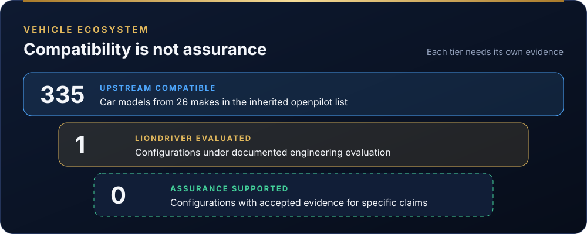

# Vehicle compatibility

  

LionDriver keeps the vehicle support of the openpilot version it pins. The authoritative list is [`docs/CARS.md`](../CARS.md), which upstream generates from the car ports in `opendbc`. LionDriver does not edit it.

> **Vehicle compatibility does not imply independent safety assurance.**
> A car that openpilot supports has not, by that fact, been analysed, verified or reviewed by LionDriver, and no vehicle is approved for unsupervised operation.

## Three classifications

| Classification | Meaning | How a configuration gets there |
|---|---|---|
| **Upstream Compatible** | Supported by the inherited openpilot integration | Listed in `docs/CARS.md` at the pinned upstream version |
| **LionDriver Evaluated** | Undergoing or completed documented engineering evaluation | A configuration record in [`assurance/case/configurations/`](../../assurance/case/configurations/) with an item definition and an impact analysis against the platform assumptions |
| **Assurance Supported** | Defined configuration with accepted evidence for specific safety claims | At least one claim for that configuration accepted through a recorded review; the validator refuses the classification otherwise |

The counts on this page and in the README are generated from those sources by [`generate_dashboard.py`](../../assurance/case/tools/generate_dashboard.py), so they cannot drift from the records.

## Current configurations

| ID | Configuration | Classification | State |
|---|---|---|---|
| [CFG-001](../../assurance/case/configurations/cfg-001-toyota-corolla-2020.yaml) | 2020 Toyota Corolla LE, Toyota Safety Sense 2.0 | LionDriver Evaluated | Evaluation in progress; no accepted claims |

The Corolla is the reference configuration for the first assurance work. It is a starting point, not a limit on the vehicles LionDriver supports.

## Adding a configuration

1. Copy [`cfg-001-toyota-corolla-2020.yaml`](../../assurance/case/configurations/cfg-001-toyota-corolla-2020.yaml) to a new `CFG-nnn` record with `classification: liondriver-evaluated` and `evaluation_state: in-progress`.
2. Record the configuration baseline: car platform, brand safety mode and parameters, each with its source in the pinned upstream code.
3. Write the [impact analysis](../../assurance/01-management/WP-M-12-impact-analysis.md): which assumptions of use hold for this vehicle, which differ, and what evidence each needs.
4. Run `python3 assurance/case/tools/validate.py` and `python3 assurance/case/tools/generate_dashboard.py`, then open a pull request.

Upstream car-port changes arrive through submodule updates and are handled by the [upstream management](../../assurance/01-management/WP-M-11-upstream-and-supplier-management.md) process, not edited in this repository.
