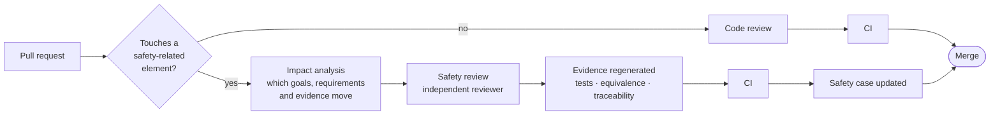

# LionDriver safety framework

This folder holds LionDriver's safety work products and the process that produces them. It is the place to start for reviewers, assessors and contributors.

> [!NOTE]
> Work products are published as they are drafted, so some are incomplete. Each one carries its status. A draft is a draft. Only a work product marked **Released**, with its confirmation review recorded, may be cited as evidence.

## How it is organized

```
docs/safety/
├── README.md                  ← this file: index, process, change workflow
├── standards.md               how ISO 26262, ISO 21448, ISO/SAE 21434, ISO/PAS 8800 and UL 4600 are applied
├── platform/                  the platform, analyzed once as a Safety Element out of Context
└── configurations/            one folder per vehicle configuration
    └── toyota-corolla-2020/      first configuration
```

LionDriver separates the **platform** from the **vehicle configurations**, following the Safety Element out of Context approach of ISO 26262-10 §9:

| Level | What is analyzed | What it produces |
|---|---|---|
| **Platform** (`platform/`) | LionDriver's functions on any supported car, over a declared operating envelope with worst-case assumptions | Item definition, HARA, safety goals, safety concepts, and an **assumptions register** listing everything the platform needs the vehicle to provide |
| **Configuration** (`configurations/<vehicle>/`) | One specific vehicle | A check of every assumption against that car, its brand safety mode, vehicle-specific evidence, and an impact analysis of any deviation |

A new vehicle enters through a configuration folder and an impact analysis. If it falls inside the envelope and meets the assumptions, it needs vehicle evidence, not a new safety program.

## Work products

Status key: ⚪ planned · 🟡 drafting · 🔵 in review · 🟢 released

### Management (ISO 26262-2, ISO/SAE 21434 §5–6)

| ID | Work product | Clause | Location | Status |
|---|---|---|---|---|
| WP-MGT-01 | Safety plan | 26262-2 §6 | [`platform/safety-plan`](platform/safety-plan/) | 🟡 Draft 0.1 |
| WP-MGT-02 | Cybersecurity plan | 21434 §6 | `platform/cybersecurity-plan` | ⚪ |
| WP-MGT-03 | Standards application and tailoring | 26262-2 §6 | [`standards.md`](standards.md) | 🟡 |
| WP-MGT-04 | Confirmation measures plan and records | 26262-2 §6 | `platform/confirmation` | ⚪ |

### Concept (ISO 26262-3, ISO 21448, ISO/SAE 21434 §9, ISO/PAS 8800)

| ID | Work product | Clause | Location | Status |
|---|---|---|---|---|
| WP-CON-01 | Item definition and operating envelope | 26262-3 §5 · 21448 §5 | `platform/item-definition` | 🟡 |
| WP-CON-02 | HARA and safety goals | 26262-3 §6 | `platform/hara` | 🟡 |
| WP-CON-03 | Assumptions register (SEooC) | 26262-10 §9 | `platform/assumptions` | 🟡 |
| WP-CON-04 | SOTIF hazard identification and triggering conditions | 21448 §6–7 | `platform/sotif` | ⚪ |
| WP-CON-05 | TARA and cybersecurity goals | 21434 §15, §9 | `platform/tara` | ⚪ |
| WP-CON-06 | AI safety requirements for learned components | 8800 | `platform/ai-safety` | ⚪ |
| WP-CON-07 | Functional safety concept | 26262-3 §7 | `platform/fsc` | ⚪ |

### System, hardware and software (ISO 26262-4, -5, -6)

| ID | Work product | Clause | Location | Status |
|---|---|---|---|---|
| WP-SYS-01 | Technical safety concept | 26262-4 §6 | `platform/tsc` | ⚪ |
| WP-SYS-02 | Assessment of existing openpilot software and hardware | 26262-8 §12 | `platform/existing-assessment` | ⚪ |
| WP-SW-01 | Software safety requirements (panda safety layer) | 26262-6 §6 | `platform/sw-safety-reqs` | ⚪ |
| WP-SW-02 | Unit verification of the safety layer | 26262-6 §9 | `configurations/*/evidence` | 🟢 Toyota mode: first evidence |
| WP-HW-01 | Hardware safety requirements and metrics | 26262-5 §6, §8–9 | `platform/hw` | ⚪ |

### Verification, validation and assurance

| ID | Work product | Clause | Location | Status |
|---|---|---|---|---|
| WP-VV-01 | Integration and HIL test specification | 26262-4 §7 · 26262-6 §10 | `platform/integration` | ⚪ |
| WP-VV-02 | Scenario catalog and SOTIF validation | 21448 §9–11 | `platform/validation` | ⚪ |
| WP-VV-03 | Safety validation report | 26262-4 §8 | `configurations/*/validation` | ⚪ |
| WP-ASR-01 | Safety case | 26262-2 §6 · UL 4600 | `platform/safety-case` | ⚪ |
| WP-ASR-02 | Tool qualification records | 26262-8 §11 | `platform/tools` | ⚪ |

## Change workflow

Every change to a safety-related element goes through impact analysis before it merges. Safety-related elements include the panda firmware, `opendbc_repo/opendbc/safety/`, the brand car controllers, driver monitoring, and any work product in this folder.



1. **Impact analysis** (ISO 26262-8 §8): which safety goals, requirements, assumptions and evidence the change touches.
2. **Independent safety review** by someone other than the author, at the independence level the affected goal's integrity level requires (ISO 26262-2 Table 1).
3. **Evidence regenerated**: tests, equivalence runs and traceability are rebuilt by CI, not edited by hand.
4. **Safety case updated** in the same pull request, so the argument never falls behind the code.

## Principles

- **Evidence over assertion.** A claim without linked evidence is a gap, and it is recorded as one.
- **Gaps are published.** What is missing goes in the same document as what is done.
- **Upstream stays upstream.** LionDriver analyzes openpilot as it is before changing it. Every deviation from upstream is a recorded design decision with a reason.
- **Tools are part of the argument.** Any tool whose output is used as evidence (compilers, generators, test harnesses) is classified under ISO 26262-8 §11.
