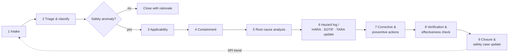

# Field Issue & Safety Anomaly Process

| Field | Value |
|---|---|
| Document ID | LD-SAF-PRC-001 |
| Revision | A (initial draft) |
| Status | Draft — pending review by the safety manager |
| Owner | LionDriver safety manager (currently: project maintainer) |
| Applies to | All LionDriver baselines, the reference vehicle configuration, and any upstream (openpilot) or fork-derived (FrogPilot, sunnypilot, …) code that LionDriver inherits |

## 1. Purpose

LionDriver inherits a driving system that is already deployed on a large fleet. Its field history tells us things that the hazard analysis (HARA), SOTIF analysis and threat analysis (TARA) can miss. This process gives every field signal one path. The signal might be a regulatory investigation, a crash report, a user complaint, a forum post or one of our own test drives. Every signal ends in one of two places:

1. a documented, evidence-backed corrective action that is verified and traced into the safety case, or
2. a documented decision, with a rationale, that no action is needed.

Nothing is closed only because it "happened on a different car" or "happened on a fork". Those are applicability questions that get answered with evidence (§5.3).

## 2. Normative basis

| Standard | Clause / topic | What this process satisfies |
|---|---|---|
| ISO 26262-7:2018 | §6 Operation, service, decommissioning; field monitoring | Field data collection, analysis of field incidents, link to corrective measures |
| ISO 26262-2:2018 | §5.4.2 / §7 Safety management incl. after release | Safety-anomaly management, confirmation of corrective actions |
| ISO 26262-8:2018 | §8 Change management | Impact analysis and controlled change for every corrective action |
| ISO 21448:2022 | §13 Operation phase activities | Field monitoring for new triggering conditions and performance limitations; feedback into SOTIF analysis |
| ISO/SAE 21434:2021 | §8 Continual cybersecurity activities (monitoring, event evaluation, vulnerability analysis/management) | Cyber events use the same intake and triage path |
| ISO/PAS 8800:2024 | Operation and continuous assurance of AI elements | Field evidence of ML insufficiencies (data distribution gaps, missed detections) |
| UL 4600 | §16 Safety Performance Indicators, field feedback | SPIs, feedback of field data into the safety case |
| U.S. regulatory context | NHTSA ODI investigations (DP / PE / EA / RQ), recalls, Standing General Order on ADS/L2 ADAS crash reporting | External intake sources |

> LionDriver is a research & development project. It makes no compliance claim (see the root `README.md`). This process makes the field-feedback loop real and auditable so it can be evaluated later.

## 3. Definitions

| Term | Definition |
|---|---|
| **Field signal** | Any report, record or observation that may show unsafe or unexpected behavior of openpilot-derived software or hardware anywhere (upstream, forks, or LionDriver). |
| **Field issue (FI)** | A field signal accepted into the register for evaluation. ID format `FI-YYYY-NNN`. |
| **Safety anomaly** | A field issue whose behavior could contribute to a hazard: it violates or could violate a safety goal, or shows a hazard, triggering condition or misuse not covered by the current analyses. |
| **Containment** | An immediate, temporary measure that limits exposure while root cause is unknown. Example: suspending test drives of a configuration. |
| **Root cause** | The deepest cause which, if removed, prevents recurrence. One event can have several root causes, one per independent protection layer that failed. |
| **Escape point** | The step in *our* lifecycle (analysis, requirement, design, verification, process) where the issue should have been caught but was not. |
| **Corrective action (CA)** | A permanent change that removes or controls a root cause. ID format `CA-NNN`. |
| **Preventive action (PA)** | A change to the process or analyses that stops the same *class* of issue from escaping again. |
| **Hazard log** | The living list of hazards and their status (`HAZARD-LOG.md`). It feeds the HARA, SOTIF analysis and TARA. |

## 4. Roles

| Role | Responsibility |
|---|---|
| **Reporter** | Anyone. Files a field signal using `templates/FIELD-ISSUE-REPORT.md` or a GitHub issue with the `field-issue` label. |
| **Safety manager** | Owns the register. Runs triage, approves containment, assigns the root cause analysis (RCA) lead, and approves closure. |
| **RCA lead** | Runs the RCA (`templates/ROOT-CAUSE-ANALYSIS.md`). Produces the evidence and the causal model. |
| **Domain experts** | Perception/ML, planning & control, vehicle integration/actuation, HMI/driver monitoring, cybersecurity, test. Brought in as the RCA needs them. |
| **Independent reviewer** | Someone other than the RCA lead and the CA implementer. Reviews root cause and closure for Class A/B issues (ISO 26262-2 confirmation measures, scaled to project size). |

In a one-person project, one person can hold several roles. Independent review must still come from someone other than the author before a Class A or B item closes. If no such person is available, the item stays in `Awaiting independent review`.

## 5. Process

### 5.1 Step 1 — Intake

**Monitored sources:**

| Source | Examples | Cadence |
|---|---|---|
| Regulators | NHTSA ODI investigations (DP/PE/EA/RQ), recalls, Standing General Order crash data, foreign equivalents (Transport Canada, KBA, …) | Weekly |
| Upstream | `commaai/openpilot`, `commaai/opendbc`, `commaai/panda` issues, safety-related PRs and reverts, release notes, safety model changes | Each upstream bump, and at least weekly |
| Forks | FrogPilot, sunnypilot and other forks that share components with our baseline | Monthly, and on any public incident |
| Media & community | Trade press, owner forums, community Discord, video reports | Weekly |
| Our own data | Drive logs (`rlog`/`qlog`) from reference-vehicle tests, disengagement reports, SIL/HIL anomalies, CI regressions | Every test campaign |
| Security | CVEs, advisories, coordinated disclosures (see `SECURITY.md`) | Continuous |
| Vehicle OEM | OEM recalls and TSBs for vehicles in scope (e.g. Toyota TSS2 ADAS ECUs) | Monthly |

**Rule:** if in doubt, log it. A false positive costs one triage entry. A missed signal can cost a life.

Every accepted signal gets an `FI-YYYY-NNN` ID and a row in `REGISTER.md`. It also gets its own folder, `cases/FI-YYYY-NNN-<slug>/`, which holds the report, the RCA and the evidence.

### 5.2 Step 2 — Triage & classification

Triage is done within **2 business days** of intake.

**Severity class.** Base the class on the worst credible outcome, not the outcome observed. A near-miss in a scenario that can kill is Class A.

| Class | Criteria (any one) | Containment decision due | RCA start due |
|---|---|---|---|
| **A — Critical** | Fatality or life-threatening injury (ISO 26262 S3) is credible; regulatory defect investigation or recall; loss of a safety mechanism (e.g. stock AEB disabled); cyber exploit with physical effect | 24 h | 3 days |
| **B — Major** | Severe/moderate injury credible (S1–S2); unexpected or unintended actuation; safety goal violated with no harm; DM or driver-alert failure | 5 days | 10 days |
| **C — Minor** | No credible injury; degraded comfort/availability; warning without hazard; documentation error | — | Next planning cycle |
| **D — Not a safety anomaly** | Feature request; not reproducible and not plausible; out of scope with evidence | — | Close with rationale |

**Root cause category.** Set this provisionally at triage and confirm it in the RCA. More than one category is allowed.

| Code | Category | Primary standard |
|---|---|---|
| `SYS` | Systematic fault (spec, design or software defect) | ISO 26262 |
| `RHF` | Random hardware fault | ISO 26262-5 |
| `PERF` | Performance limitation / functional insufficiency (works as designed, design not good enough) | ISO 21448 |
| `ML` | Insufficiency of an ML element (training-data gap, out-of-distribution input) | ISO/PAS 8800, ISO 21448 |
| `MISUSE` | Reasonably foreseeable misuse (inattention, over-trust, use outside the operating domain) | ISO 21448 / ISO 26262-3 |
| `CFG` | Configuration / variant fault (wrong parameters, unsupported fork modifications, alpha features) | ISO 26262-8 |
| `CYB` | Cybersecurity event | ISO/SAE 21434 |
| `PROC` | Process escape (missing analysis, test or review) | ISO 26262-2 |

### 5.3 Step 3 — Applicability to LionDriver

Most field issues will come from upstream, forks or other vehicles. Before you dismiss one as "not ours", fill in the applicability matrix in the report template:

- **Shared code:** is the faulty component (model, `radard`, planner, car port, panda safety mode, DM policy) in our baseline? At which commit?
- **Shared platform:** same OEM, same ADAS architecture (e.g. Toyota TSS2), same actuator path, same stock safety systems?
- **Shared scenario:** could the triggering condition occur inside our operating domain?
- **Shared human factors:** same HMI, DM policy and driver population?

An issue is **not applicable** only if every row is answered "no" *with evidence*: a file and commit, a platform flag, a domain exclusion. "Different car" is not evidence on its own.

### 5.4 Step 4 — Containment

Containment limits exposure **now**, while root cause is unknown. Options, strongest first:

1. Suspend operation of the affected configuration (no test drives).
2. Restrict the operating domain (e.g. no highway, daylight only, no longitudinal control).
3. Turn off the affected feature or toggle in the baseline.
4. Add an operational procedure (e.g. a safety driver with a hand-on-brake rule).
5. Warn or brief the operators.

Record the decision **including "no containment" with its rationale**. Containment stays in force until the corrective action is verified.

### 5.5 Step 5 — Root cause analysis

Use `templates/ROOT-CAUSE-ANALYSIS.md`. Minimum methods by class:

| Method | Class A | Class B | Class C |
|---|---|---|---|
| Timeline / sequence of events | ✔ | ✔ | ✔ |
| Protection-layer (barrier) analysis | ✔ | ✔ | — |
| Fault tree (FTA, qualitative) | ✔ | ○ | — |
| STPA unsafe control actions | ✔ | ○ | — |
| Fishbone (Ishikawa) | ✔ | ✔ | ○ |
| 5-Why per root-cause branch | ✔ | ✔ | ✔ |
| SOTIF triggering-condition analysis | ✔ if `PERF`/`ML` | ✔ if `PERF`/`ML` | — |
| Escape-point analysis | ✔ | ✔ | ○ |

✔ required · ○ recommended

**Fishbone categories for this system:** Perception (camera, model, radar); Fusion & lead selection; Planning & control; Actuation & vehicle (car port, OEM ECUs, stock ADAS); Driver monitoring & HMI; Driver & use; Configuration & process; Environment & scenario.

**Rules of evidence:**

- Every causal claim is tagged **Verified** (code at a pinned commit, log data, reproduction), **Supported** (consistent with available evidence, not yet reproduced) or **Hypothesis** (plausible, untested).
- An RCA cannot close while a root cause it relies on is still a **Hypothesis**. Either confirm it (reproduce in replay/SIL/HIL) or close the CA against *all* credible hypotheses.
- Cite code as `path:line @ commit`. Cite external facts with a link.
- **Do not stop at "driver error".** Over-trust, inattention and late reaction are foreseeable misuse. The question is why the system design allowed them to become a crash.

### 5.6 Step 6 — Feed back into the hazard log and analyses

For each root cause, ask: *was this hazard, triggering condition, misuse or threat already in our analyses, and did we estimate its severity, exposure and controllability correctly?*

| Finding | Action |
|---|---|
| New hazard or hazardous event | New row in `HAZARD-LOG.md`, flagged `HARA-pending` until the HARA is reissued |
| Known hazard, but S/E/C ratings or ASIL wrong given field data | Raise a HARA change request, citing the FI |
| New SOTIF triggering condition or performance limitation | Add to the SOTIF triggering-condition catalog and scenario database |
| New foreseeable misuse | Add to the misuse list; re-check controllability assumptions |
| New threat or vulnerability | Add to the TARA |
| Missing or ineffective safety mechanism | Raise a functional/technical safety requirement change |

> Until the first HARA is issued (README roadmap), `HAZARD-LOG.md` is the authoritative input list for it. Every entry must be dispositioned in the first HARA.

### 5.7 Step 7 — Corrective and preventive actions

Use `templates/CORRECTIVE-ACTION.md`. Each CA:

- addresses a named root cause and a named hazard-log entry;
- is ranked on the **hierarchy of controls**. Prefer the strongest feasible tier, and say why a weaker tier was chosen:
  1. **Eliminate**: remove the hazardous capability or configuration.
  2. **Inherent design**: change the design so the hazard cannot develop (requirements, architecture, limits).
  3. **Safety mechanism**: detect and react (monitor, fallback, interlock).
  4. **Warning / HMI**: alert the driver in time to act.
  5. **Information / procedure**: limitations docs, training. *Never the only control for Class A.*
- goes through change management: an impact analysis on safety goals, requirements, architecture, other variants and *new hazards introduced by the fix* (e.g. more braking → phantom braking and rear-end risk);
- has acceptance criteria that can be measured and a verification method decided **before** implementation.

Preventive actions fix the **escape point**: a missing analysis, a test gap, a review step, a monitoring gap.

### 5.8 Step 8 — Verification and effectiveness

- **Verification:** show the CA meets its acceptance criteria (unit/SIL/replay/HIL/vehicle test). For Class A/B, also show the original failure reproduced *before* the fix and is absent *after* it.
- **Regression:** the scenario becomes a permanent regression test in CI or the scenario database.
- **Effectiveness:** watch the related safety performance indicators (§6) for an agreed period after release.

### 5.9 Step 9 — Closure

Closure needs all of the following:

- [ ] Root causes confirmed (no open hypotheses relied upon), or every credible hypothesis covered
- [ ] Hazard log and analyses updated, or a change request raised and linked
- [ ] All corrective and preventive actions verified, with the evidence linked
- [ ] Containment lifted, or made permanent with rationale
- [ ] Regression test in place
- [ ] Independent review signed (Class A/B)
- [ ] Safety case updated (claims, arguments, evidence affected)
- [ ] Lessons learned recorded in `REGISTER.md`

## 6. Safety performance indicators (SPIs)

Track these from our own test data. They are leading indicators: they move before a crash happens.

| SPI | Definition | Purpose |
|---|---|---|
| SPI-01 | Safety-relevant disengagements per 1,000 km, by cause | Overall field health |
| SPI-02 | Late lead detections: stationary/slow in-lane vehicles first detected at a range below the required stopping distance (§ case FI-2026-001) | Stopped-vehicle performance |
| SPI-03 | FCW events, with time-to-collision at alert onset | Warning timeliness |
| SPI-04 | Stock AEB/PCS activations while engaged | Primary system missed something; second layer acted |
| SPI-05 | Driver-distraction alerts reaching level 2/3, per hour engaged | Driver engagement |
| SPI-06 | Phantom/unnecessary hard braking events | Monitors the side effects of braking-related corrective actions |
| SPI-07 | Open Class A/B field issues, and their age | Process health |

## 7. Records

| Record | Location |
|---|---|
| Field issue register | `docs/safety/field-monitoring/REGISTER.md` |
| Hazard log | `docs/safety/field-monitoring/HAZARD-LOG.md` |
| Per-issue case files | `docs/safety/field-monitoring/cases/FI-YYYY-NNN-<slug>/` |
| Templates | `docs/safety/field-monitoring/templates/` |

Records are version-controlled. Do not rewrite history on a closed case. Correct it with a new revision entry.

## 8. Revision history

| Rev | Date | Author | Change |
|---|---|---|---|
| A | 2026-10-10 | LionDriver maintainers | Initial draft; first case FI-2026-001 (NHTSA PE26007) |
