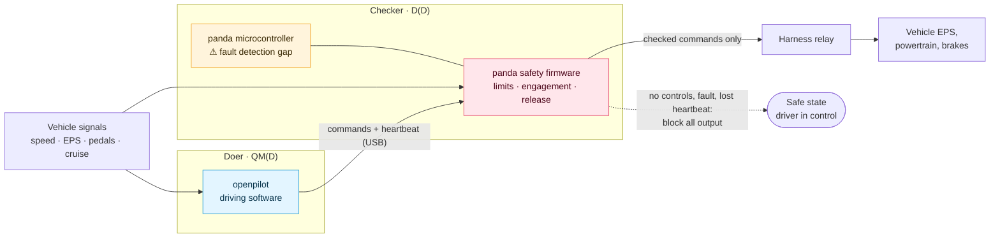

# Functional safety concept · LD-FSC-001

**Revision 0.1 (draft)** · ISO 26262-3 §7 · From [HARA LD-HARA-001](../hara/) · Item [LD-ITD-001](../item-definition/)

| File | What it is |
|---|---|
| [`LD-FSC-001_fsc.xlsx`](LD-FSC-001_fsc.xlsx) | 9 tabs: safety goals, architecture nodes, fault trees, 153 functional safety requirements with status and evidence, ASIL allocation, verification methods, TSC hand-off |
| [`fsc.json`](fsc.json) | **Source of truth**: architecture, the concrete requirements with status and evidence, the proposed decomposition |
| [`build.py`](build.py) | Regenerates the workbook from `fsc.json` and the HARA |

> [!WARNING]
> **Draft, not released.** Pending independent confirmation review (safety plan anomaly A01).

## The concept in one picture

The five ASIL D safety goals are all about **authority**: what the car is made to do, and whether the driver can take it back. LionDriver already has a component whose only job is authority: the panda safety firmware. The concept assigns the ASIL D requirements to it and lets the driving software be QM behind it.

**Proposed decomposition (ISO 26262-9 §5):** for SG-001 to SG-005, **D(D)** on the panda safety firmware and **QM(D)** on openpilot. Not claimed yet. It needs a dependent-failure analysis showing the two are independent enough:

| Common cause | Why it may be acceptable | Status |
|---|---|---|
| 12 V harness supply | Its loss opens the relay and stops all output, which is the safe state | To argue in the DFA |
| USB link between them | The panda checks every command it carries; silence triggers the heartbeat timeout | To argue in the DFA |
| panda microcontroller faults | **Not acceptable as is**: a fault here could corrupt the checker itself | **Gap: see below** |

## Requirements per safety goal

The workbook expands every safety goal over every architecture node (153 requirements). These 29 are concrete; the rest are template wording, flagged for refinement in the technical safety concept.

**Status key:** ✅ implemented in upstream code · 🟡 implemented, but a parameter or verification still needs specifying · ❌ gap

### SG-001 · Prevent unintended lateral motion · ASIL D

| Node | Requirement (short form) | Status | Where |
|---|---|---|---|
| panda firmware | Forward a steering command only while controls are allowed and within limits on magnitude, rate, deviation from measured EPS torque or angle, and change per 250 ms | ✅ | `lateral.h`; Toyota proven by the [XZACT equivalence check](../../configurations/toyota-corolla-2020/#evidence) |
| EPS torque and angle in | Reject bad checksum or quality flag; end controls if missing over 1 s (detected within 2 s) | ✅ | `safety.h` rx checks, `safety_tick` |
| Wheel speeds in | Base speed-dependent limits on the slowest recent speed; end controls on wheel-speed faults | ✅ | `lateral.h`, safety mode |
| USB heartbeat | End controls after 3 s of reported disengagement; stop all output after 5 s without heartbeat | ✅ | `panda/board/main.c` |
| Harness relay | Detect relay malfunction, latch it, block all output | ✅ | `stock_ecu_check` |
| Safety mode selection | Fall back to SILENT on a failed or unknown mode; openpilot disengages on a mode or parameter mismatch | ✅ | `set_safety_mode`; `selfdrived` controlsMismatch |
| CAN out | Transmit only whitelisted addresses, bus and length | ✅ | `tx_msg_safety_check` |
| openpilot | Apply the same limits itself, so the checker is a backstop | ✅ QM | car controllers |
| **panda microcontroller** | **Detect CPU, clock, RAM and flash faults and enter a no-output state within the FTTI** | ❌ | **Gap** |

### SG-002 · Prevent unintended acceleration · ASIL D

| Node | Requirement (short form) | Status |
|---|---|---|
| panda firmware | Non-zero acceleration only while controls are allowed, gas not pressed, and within range (Toyota −3.5 to +2.0 m/s²) | ✅ `longitudinal.h` |
| Pedal and cruise in | Reject bad checksum; end controls if missing | ✅ |
| CAN out | Whitelist; cancel-only under stock longitudinal | ✅ |
| panda microcontroller | As SG-001 | ❌ Gap |

### SG-003 · Prevent unintended deceleration · ASIL D

| Node | Requirement (short form) | Status |
|---|---|---|
| panda firmware | Bound deceleration (Toyota −3.5 m/s²); non-zero only while controls are allowed | ✅ magnitude only |
| panda microcontroller | As SG-001 | ❌ Gap |

The panda can bound *how hard* the car brakes, not *whether braking is warranted*. Phantom braking within the bound is a performance limitation of the driving model, so its residual risk moves to the SOTIF analysis (WP-CON-04).

### SG-004 · Prevent failure to release control · ASIL D

| Node | Requirement (short form) | Status |
|---|---|---|
| panda firmware | End controls on brake rising edge, brake while moving, cruise disengage, invalid or late messages; block every actuating command without controls | ✅ `generic_rx_checks`, `pcm_cruise_check` |
| Brake and cruise in | Check presence and checksum where available | ✅ (Toyota brake has no vehicle checksum: assumption ASM-V-03 to verify) |
| USB heartbeat | As SG-001 | ✅ |
| panda microcontroller | As SG-001 | ❌ Gap |

### SG-005 · Prevent engagement without driver action · ASIL D

| Node | Requirement (short form) | Status |
|---|---|---|
| panda firmware | Allow controls only on the rising edge of stock cruise engagement; openpilot cannot grant controls | ✅ `pcm_cruise_check` |
| panda microcontroller | As SG-001 | ❌ Gap |

### SG-006 to SG-009 · ASIL C and B

| Goal | Requirement (short form) | Status |
|---|---|---|
| SG-006 loss of lateral control (C) | Audible take-over request whenever lateral control is lost, saturated or ending; never stop steering silently | 🟡 timing to specify |
| SG-006 | Take-over requests audible and visible until acknowledged | 🟡 verification to specify |
| SG-007 insufficient braking (C) | Audible take-over request when needed deceleration exceeds what may be commanded | 🟡 thresholds to specify |
| SG-008 undetected inattention (B) | Escalate at 5 s, 8 s, 13 s of distraction; fall back to the 5/15/25 s wheel-touch policy after 10 s of uncertainty | ✅ `monitoring/policy.py` |
| SG-008 | Driver camera loss prevents engagement and disengages with an alert | 🟡 to verify |
| SG-009 mode confusion (B) | Displayed state agrees with the panda's; disengage on mismatch | ✅ controlsMismatch |
| SG-009 | Engagement changes signaled audibly and visually | 🟡 verification to specify |

## Gaps

| # | Gap | Affects | Next step |
|---|---|---|---|
| G1 | **panda microcontroller fault detection.** Only a software watchdog on the main loop and interrupt-rate monitoring, and both just record faults. No lockstep core, no independent hardware watchdog, and no evidence that a recorded fault leads to a no-output state | SG-001 to SG-005; blocks the D(D) claim | Hardware assessment of the STM32H7's safety mechanisms (ECC, clock monitoring); decide between an external watchdog with relay cut-off, a second monitoring MCU, or both |
| G2 | **FTTIs not set** | All goals | Measure lateral deviation and longitudinal effect over time under the maximum allowed command on the reference vehicle, then check each mechanism's reaction time against it: one CAN frame for limits and brake release, up to 2 s for message loss, 3 s and 5 s for heartbeat supervision |
| G3 | **Dependent-failure analysis** for the doer/checker split | SG-001 to SG-005 | DFA per ISO 26262-9 §7 |
| G4 | **Phantom braking within limits** | SG-003 | SOTIF analysis (WP-CON-04) |
| G5 | **Brake signal integrity** on Toyota (no vehicle-side checksum) | SG-004 | Verify assumption ASM-V-03 on the Corolla |

## Next

The [technical safety concept LD-TSC-001](../tsc/) takes every requirement here down to hardware and software, and proposes the design for G1.
