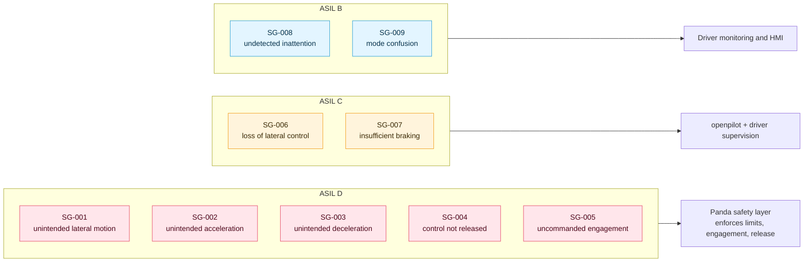

# HARA and safety goals · LD-HARA-001

**Revision 0.1 (draft)** · ISO 26262-3 §6 · Item: [LD-ITD-001](../item-definition/)

| File | What it is |
|---|---|
| [`LD-HARA-001_hara.xlsx`](LD-HARA-001_hara.xlsx) | The full HARA: 15 tabs, 84 function × malfunction pairs, 700 rated hazardous events, ASIL by formula, safety goals, FSC hand-off |
| [`hara.json`](hara.json) | **Source of truth**: every classification, hazard, safe state and rating override, with its rationale |
| [`build.py`](build.py) | Expands `hara.json` with the item definition and regenerates the workbook |

> [!WARNING]
> **Draft, not released.** Ratings are a first analysis for review. They cannot be confirmed until an independent reviewer is available (safety plan anomaly A01).

## Safety goals

| ID | Safety goal | Worst-case ASIL | Safe state |
|---|---|---|---|
| **SG-001** | Prevent unintended lateral motion (steering too much, too fast, in the wrong direction, or uncommanded) | **D** | Panda blocks all steering commands; stock steering returns full authority to the driver; audible take-over alert |
| **SG-002** | Prevent unintended or excessive acceleration | **D** | No acceleration or braking request; driver controls speed; audible alert |
| **SG-003** | Prevent unintended or excessive deceleration that exposes the vehicle to a rear-end collision | **D** | As SG-002 |
| **SG-004** | Prevent failure to release control when the driver brakes, cancels or overrides | **D** | Panda blocks every actuator command until the driver engages again |
| **SG-005** | Prevent engagement of control without a deliberate driver action | **D** | As SG-004 |
| **SG-006** | Prevent loss or weakness of lateral control while the driver relies on it | **C** | As SG-001 |
| **SG-007** | Prevent insufficient deceleration when braking is needed | **C** | As SG-002 |
| **SG-008** | Prevent undetected or unescalated driver inattention | **B** | Escalate to disengagement; engagement unavailable until monitoring is healthy |
| **SG-009** | Prevent driver unawareness of the system state | **B** | Disengage with an audible alert when the displayed state cannot be guaranteed |

**The provisional ASIL D target in the safety plan holds:** five goals reach ASIL D.

The right-hand side is a first hint for the functional safety concept, not a decision: every ASIL D goal is about authority (what the car is made to do and whether the driver can take it back), which is exactly what the panda checker controls.

## Method

- **Every function against all 14 malfunction guide words.** All 84 pairs are recorded with a classification and rationale: 53 safety-critical, the rest not safety-critical or not applicable. Where two malfunctions produce the same vehicle behavior, one is evaluated through the other and the link is recorded (28 pairs are rated directly).
- **Operating environment from the confirmed envelope:** five locations from parking lot to motorway (0–130 km/h) × five conditions (dry, wet, night, heavy rain, fog). Off-road and snow or ice are outside the envelope and excluded. Fog is kept because a driver can foreseeably stay engaged in it.
- **No credit for the item's own safety mechanisms.** As ISO 26262-3 requires, hazards are rated as if the panda supervision (F05) did not exist. Its own failures are analyzed later, in the functional and technical safety concepts.
- **Generator heuristics, then analyst overrides.** S, E and C start from speed- and authority-based heuristics. The overrides below replace them where they misjudge this item, each with its rationale in `hara.json`.

## Analyst judgments to review

These are the calls that move the results most. Each is a reviewer's first stop.

| # | Judgment | Effect | Alternative |
|---|---|---|---|
| 1 | **Every ASIL D comes from one cell: motorway, dry daylight, S3 E4 C3.** All other environments for those hazards rate C or lower | The five ASIL D goals stand or fall on C3 at motorway speed | A credible C2 argument for any of them (for example, bounded phantom-braking deceleration is controllable by following traffic) lowers that goal to C |
| 2 | **Loss of assistance (H02, H05) rated C2**, overriding the heuristic's C3 at speed | SG-006 and SG-007 at C, not D | C1 is arguable for a supervised Level 2 system; C3 if foreseeable over-reliance is weighted |
| 3 | **Driver monitoring failure (H08): E2, C3**, severity by speed band | SG-008 at B | E is the share of time an inattentive driver meets a situation the system does not handle. It needs field data |
| 4 | **Mode confusion (H09): E3, C2**, severity by speed band | SG-009 at B | C3 if the vehicle gives no cue (for example on a straight road) |
| 5 | **Fog kept in the analysis**, although outside the validated conditions | Adds rows; no worst case changes | Exclude if the system reliably refuses to engage in fog: a SOTIF question |

## Hand-off to the functional safety concept

Tab 14 of the workbook lists each safety goal with placeholder functional safety requirements, fault-tolerant time interval (FTTI) and allocation columns. The next work product (WP-CON-07) fills them in, starting with how the panda's existing limits, engagement and release logic map onto SG-001 to SG-005.
