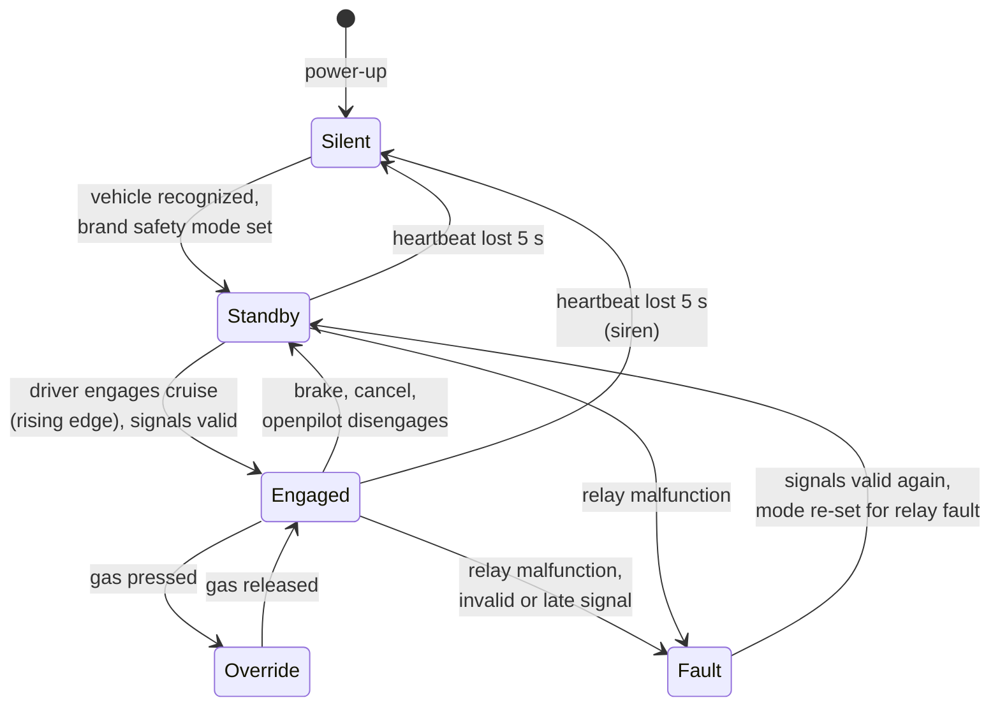

# Item definition · LD-ITD-001

**Revision 0.1 (draft)** · ISO 26262-3 §5 · Feeds the [HARA](../hara/)

| File | What it is |
|---|---|
| [`LD-ITD-001_item-definition.xlsx`](LD-ITD-001_item-definition.xlsx) | The item definition as an 11-tab workbook |
| [`item-definition.json`](item-definition.json) | **Source of truth.** Regenerate the workbook with the item-definition generator |

> [!WARNING]
> **Draft, not released.** Pending independent confirmation review (safety plan anomaly A01).

## The item

**LionDriver Level 2 Driver Assistance Platform (LD-L2).** An aftermarket SAE Level 2 system that provides lane centering and adaptive cruise while an attentive driver supervises. The openpilot software proposes steering and acceleration commands. The panda safety layer forwards only commands within actuator limits, and only while the driver has engaged. Analyzed as a Safety Element out of Context (ISO 26262-10 §9).

**The boundary is the harness.** Everything that can command an actuator passes through it, and the panda decides what crosses.

| Inside the item | Outside the item |
|---|---|
| openpilot software on the comma device | Steering, powertrain and brake ECUs |
| panda firmware with the brand safety mode | Stock ADAS camera and radar, stock emergency braking |
| Vehicle harness and relay | Vehicle CAN wiring beyond the harness |
| comma device cameras, IMU, GNSS, display, speaker | The driver · comma.ai cloud and update services |

## Functions

| ID | Function | Allocated to |
|---|---|---|
| F01 | Lateral control (lane centering) | openpilot → panda → vehicle EPS |
| F02 | Longitudinal control (adaptive cruise, stop and go) | openpilot → panda → vehicle powertrain and brakes |
| F03 | Engagement management | panda |
| F04 | Driver monitoring | openpilot |
| F05 | Safety supervision | panda (firmware and relay hardware) |
| F06 | Driver information | openpilot UI, display and speaker |

## Operating modes

Taken from the panda firmware (`panda/board/main.c`) and the safety modes:

In **Silent** the panda opens the harness relay, reconnecting the stock ADAS camera, and transmits nothing. If the panda allows control but openpilot has not reported itself engaged for 3 s, control ends.

## Key interfaces

| ID | Interface | Integrity |
|---|---|---|
| I01 | Vehicle CAN in: wheel speeds, steering, pedals, cruise | Brand checksums and quality flags where available; 1 s timeouts; whitelist |
| I02 | Vehicle CAN out: steering and acceleration commands | Every frame checked by the panda against limits and engagement |
| I03 | Stock camera bus through the harness relay | Relay-malfunction latch stops all output |
| I04 | USB, comma device to panda | Heartbeat supervision: 5 s loss ends output; 3 s engagement mismatch ends control |
| I05–I08 | Cameras, driver controls, HMI | Performance limits under ISO 21448 |
| I09 | Updates and cloud | Outside this safety item; covered by the TARA |

## Assumptions

The operating envelope (A01) and the eight vehicle assumptions (A02, detailed in the [assumptions register](../README.md#assumptions-register-first-entries)) are what each vehicle configuration must meet. Driver assumptions (A03, A04) set the controllability ratings in the HARA, including foreseeable misuse such as inattention and over-reliance.
