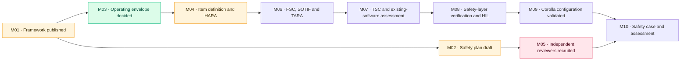

# Safety plan · LD-SPL-001

**Revision 0.1 (draft)** · ISO 26262-2 §6 · Functional Safety Manager: Jherrod Thomas

| File | What it is |
|---|---|
| [`LD-SPL-001_safety-plan.xlsx`](LD-SPL-001_safety-plan.xlsx) | The plan as a 12-tab workbook: roles, tailoring, work products, confirmation reviews, tools, resources, anomalies, schedule, references |
| [`safety-plan.json`](safety-plan.json) | **Source of truth.** Edit this, never the workbook |
| [`build.py`](build.py) | Regenerates the workbook from the JSON |

> [!WARNING]
> **Draft, not released.** The plan cannot be released until an independent reviewer confirms it (anomaly A01 below).

## Key decisions

**Target integrity: ASIL D, provisional.** The HARA has not been done yet. Planning for the highest level sets the strictest review independence now (I3, ISO 26262-2 Table 1), and lowering a target later is cheap; raising one late is not. The HARA (milestone M04) confirms or revises it.

**Platform first.** The plan covers LionDriver as a Safety Element out of Context (ISO 26262-10 §9). Vehicle configurations, starting with the 2020 Toyota Corolla LE, are verified against the platform's assumptions.

**Upstream is existing software.** No development interface agreement is possible with comma.ai. openpilot, panda and opendbc are pinned by commit and qualified as existing software (ISO 26262-8 §12), and every pin update goes through impact analysis.

## Tailoring

| ISO 26262 part | Applies | Why |
|---|---|---|
| 2 Management | ✅ | Safety plan, confirmation measures, safety case |
| 3 Concept | ✅ | Platform-level item definition, HARA, functional safety concept |
| 4 System | ✅ | Technical safety concept, integration, safety validation |
| 5 Hardware | ◐ | Panda and harness only; the vehicle's ECUs are outside the item |
| 6 Software | ✅ | Full rigor on the safety layer; driving software argued as QM behind it |
| 7 Production | ❌ | Research platform, no production. Revisit before distributing hardware |
| 8 Supporting | ✅ | Change and configuration management, tool qualification, existing software |
| 9 Analyses | ✅ | Possible ASIL decomposition between doer and checker; dependent failures |
| 10 Guidelines | ✅ | SEooC approach |
| 11 Semiconductors | ◐ | Panda microcontroller safety mechanisms |
| 12 Motorcycles | ❌ | Passenger cars and light SUVs only |

## Roles

| Role | Assigned |
|---|---|
| Functional Safety Manager | Jherrod Thomas |
| Project Manager | Jherrod Thomas (interim) |
| Safety-layer Software Lead · Hardware Lead · SOTIF and AI Safety Lead · Cybersecurity Manager | **Vacant** |
| Confirmation Reviewer (I3) · Functional Safety Assessor (external) | **Vacant: blocking** |

## Tools and confidence levels (provisional)

| Tool | Use | TCL | Basis |
|---|---|---|---|
| arm-none-eabi-gcc | Compiles the panda firmware | **TCL3** | Can introduce faults; route to TCL2 is back-to-back testing of the built firmware against the host build, plus HIL |
| cppcheck MISRA addon | MISRA C:2012 checks | TCL2 | Missed violations are partly caught by review and tests |
| libsafety unit tests · gcov | Safety-mode tests and coverage | TCL2 | Cross-checked by mutation analysis and the independent XZACT coverage |
| openpilot process replay | Regression detection on recorded drives | TCL2 | Complemented by unit tests and validation |
| opendbc mutation tests | Checks that tests detect faults | TCL1 | Cannot introduce or hide a product defect |
| XZACT compiler and equivalence harness | Independent re-implementation of the Toyota mode | TCL1 | Used only as diverse evidence; a miscompile surfaces as a mismatch |
| tinygrad | Runs the learned models | TBD | Depends on the doer/checker independence argument |
| SCons · GitHub Actions · Jenkins · Git | Build, CI, configuration management | TCL1 | Faults surface as build or test failures |

## Open anomalies

| ID | Severity | Anomaly | Resolution path |
|---|---|---|---|
| A01 | Major | No independent reviewers; ASIL D needs I3 confirmation reviews | Recruit reviewers (M05). Until then no review can close |
| A02 | Minor | XZACT compiler silently miscompiled valid programs | No product impact as TCL1 evidence; blocks any product use of XZACT code |
| A03 | Major | No development interface agreement with upstream | Qualify upstream as existing software; impact-analyze every pin update |
| A04 | Minor | ASIL D is a pre-HARA assumption | Draft HARA supports it (five ASIL D goals); closes at the HARA's confirmation review |
| A05 | Major | panda microcontroller fault detection insufficient for ASIL D (FSC gap G1) | Assess the MCU; external watchdog with relay cut-off and/or a monitoring MCU. Blocks the decomposition |

## Schedule (proposed)

| Milestone | Target |
|---|---|
| M01–M04 | 2026 Q4 |
| M05–M06 | 2027 Q1 |
| M07 | 2027 Q2 |
| M08 | 2027 Q3 |
| M09 | 2027 Q4 |
| M10 | 2028 Q1 |

Dates are proposals for the maintainer to confirm, not commitments.
