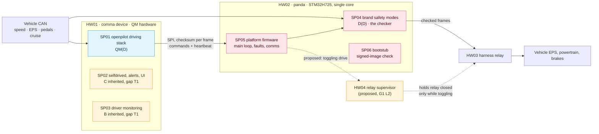
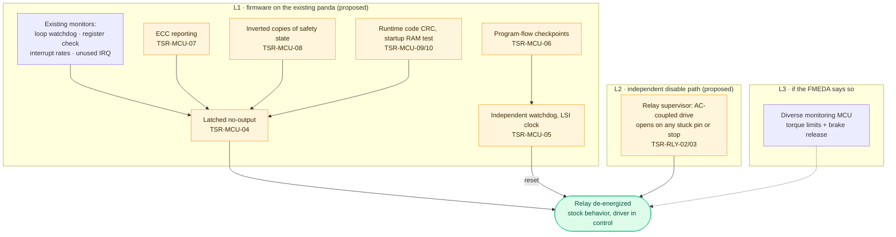

# Technical safety concept · LD-TSC-001

**Revision 0.1 (draft)** · ISO 26262-4 §6 · From [FSC LD-FSC-001](../fsc/) · Code pinned at panda 92eb565, opendbc 229dc70

| File | What it is |
|---|---|
| [`LD-TSC-001_tsc.xlsx`](LD-TSC-001_tsc.xlsx) | 15 tabs: FSC requirements with their dispositions, architecture, safety mechanisms, TSR catalog, HSI, timing, system FMEA scaffold, DFA, verification, HW and SW hand-offs, the G1 design, open items |
| [`tsc.json`](tsc.json) | **Source of truth**: architecture, mechanisms, TSRs with status and code location, the disposition rule for every FSC requirement, HSI, timing, DFA, gaps |
| [`build.py`](build.py) | Regenerates the workbook from `tsc.json` and the FSC, and fails if any FSC requirement has no disposition |
| [`LD-TSC-001_architecture.drawio`](LD-TSC-001_architecture.drawio) | The FSC nodes as an editable [draw.io](https://app.diagrams.net) diagram |

> [!WARNING]
> **Draft, not released.** Pending independent confirmation review (safety plan anomaly A01). Nothing here claims compliance.

## Where each requirement lands

The FSC expanded nine safety goals over its 17 ASIL-relevant architecture nodes into 153 requirements. The TSC gives each one a disposition and points it at concrete technical safety requirements (TSRs):

| Disposition | FSC requirements | Meaning |
|---|---:|---|
| Refined | 76 | Implemented by named TSRs |
| Covered | 51 | Bounded by another element: mostly the doer-side nodes, whose every command the panda checks under the proposed decomposition |
| Not applicable | 26 | The node takes no part in that goal's function (for example, the road camera in driver monitoring), with the reason recorded |

The 44 TSRs: **30 already exist in the upstream code**, 11 are proposed (mostly to close G1), and 3 are implemented or assumed but still need proof.

## Architecture

**Correction to the FSC:** node N07 is called the "USB link". On the comma 3X the internal panda is reached over SPI, with an 8-bit XOR checksum on every frame from the device (the panda's replies use a CRC-8) and ACK/NACK handshakes (`panda/board/drivers/spi.h`). The requirements don't change. The XOR checksum misses some multi-bit errors; that is acceptable only because the panda checks every command anyway, and the FMEDA should confirm it.

## G1 · panda microcontroller faults

G1 decides whether the panda hardware can carry ASIL D at all. Reading the firmware gives a clearer picture than the FSC had:

| Fault class | What happens today | Where |
|---|---|---|
| Crash (HardFault, NMI) | ✅ MCU resets and starts in SILENT, relay de-energized | `board/early_init.h`, `board/main.c` |
| Crystal failure | ✅ The clock security system raises an NMI, which resets the MCU | `board/stm32h7/clock.h` |
| Corrupt firmware image | ✅ The bootstub refuses an image whose RSA signature fails | `board/bootstub.c` |
| Main-loop stall, register corruption, interrupt storms | ⚠️ **Detected but only recorded.** `fault_occurred()` sets a health bit; output continues; openpilot acts only on relay malfunction | `board/sys/faults.h` |
| Hang with the relay pin latched on | ❌ No independent watchdog: `IWDG1` is defined but never started | `board/stm32h7/stm32h7_config.h` |
| RAM or flash bit errors | ❌ The STM32H7 has ECC, but the firmware neither enables nor handles its error reporting | `interrupt_handlers.h` |
| Silent computation error (no lockstep) | ❌ Nothing detects a wrong result from a running core | — |

The proposed design layers three measures, cheapest first:

**Why the relay supervisor matters:** the relay is the one place where every LionDriver output can be cut, and de-energizing it already gives stock behavior. Today the panda holds it closed with a steady pin level, so a hang can hold it closed. Driving it through an AC-coupled stage from a toggling signal means only a running, healthy firmware can keep it closed: stuck high, stuck low, hang and reset all open it, with no software involved.

**Decision rule:** implement L1, design L2, then run the panda FMEDA (WP-HW-01). ASIL D needs a single-point fault metric of at least 99 %, a latent fault metric of at least 90 % and a PMHF below 10 FIT (ISO 26262-5 §8–9). If L1 and L2 can't get a single non-lockstep core there, add L3 or revisit the controllability ratings that make SG-001 to SG-005 ASIL D (see the [HARA review notes](../hara/)).

## Timing

FTTIs are still unknown (G2), so the TSC records what each mechanism needs, ready to compare against the vehicle measurements:

| Mechanism | Detection | Reaction | Comment |
|---|---|---|---|
| Command limits, transmit whitelist | Before the frame is sent | Frame never reaches the bus | The FTTI is measured with the largest command these limits allow |
| Brake release | One brake-message period | Next steering frame blocked | Plus the EPS ramp-down |
| Vehicle message timeout | **Up to 2 s** | Next frame blocked | Probably too slow for a lateral FTTI: candidate for a faster check |
| Device heartbeat loss | 5 s | Relay release | Limits keep applying meanwhile |
| Crash reset | < 1 ms | Reset + relay release | Pins drop at reset |
| Independent watchdog (proposed) | ≤ 250 ms | Reset + relay release | Set from the FTTI |
| Relay supervisor (proposed) | ≤ 20 ms | Relay release | Independent of firmware and clock tree |

The relay's release time appears in every reaction path and still needs measuring (TSR-RLY-04).

## Dependent-failure analysis (G3)

The D(D) + QM(D) split between the panda and openpilot needs them to fail independently. Of the 12 coupling factors in ISO 26262-9 §7:

| Result | Factors |
|---|---|
| Independence argued (5) | clock · bus (the checker validates every command it carries) · memory · OS · compiler |
| Mitigation in progress (4) | supply · vehicle sensors · development team · test process |
| To argue with a measurement (1) | ground |
| **Open (2)** | **shared limit values** (both sides take them from the same opendbc team) · **shared enclosure** (the panda sits inside the device, so heat and EMC hit both) |

The decomposition therefore stays proposed, not claimed. G1 is a third open item, because the checker shares its MCU with the platform firmware (gap T2).

## Open items

| # | Gap | Status |
|---|---|---|
| G1 | panda MCU fault detection | Design proposed (L1, L2); the FMEDA decides on L3 |
| G2 | FTTIs not set | Open; the timing table above is ready for the measurements |
| G3 | Dependent-failure analysis | Drafted here; 2 factors open, plus G1 |
| G4 | Phantom braking within limits | Open; a deceleration-rate limit is under evaluation (TSR-LON-03); SOTIF |
| G5 | Toyota brake signal integrity | Open (TSR-RX-03) |
| **T1** | **ASIL B/C alert and driver-monitoring requirements run on QM hardware and Linux** | **New.** Per goal: develop the alert path to the required ASIL, use the panda's own siren as an independent second channel (TSR-ALR-05), or revisit the ratings. Driver monitoring also needs ISO/PAS 8800 for its model |
| **T2** | **Platform firmware shares the MCU with the checker without memory protection** | **New.** Develop it to ASIL D, or show freedom from interference with the Cortex-M7 MPU |

## Next

1. **Implement G1 layer 1** in LionDriver's panda firmware, with a fault-injection test for each measure. It needs no new hardware.
2. **FMEDA of the panda board** (WP-HW-01): turns the open DC% values into numbers and decides L3.
3. **Measure FTTIs** on the reference Corolla (G2), then set the watchdog, supervisor and timeout values.
4. Software safety requirements for the panda firmware (WP-SW-01), starting from the SW hand-off tab.
