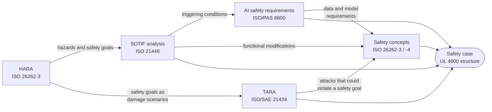

# How LionDriver applies the standards

LionDriver uses five standards, each for the question it was written to answer. This page covers what each one is for here, what it produces, how the standards hand work to each other, and where we deliberately tailor or leave things out.

| Standard | Edition | Question | Applied to |
|---|---|---|---|
| [ISO 26262](#iso-26262--functional-safety) | 2018 | What if something breaks? | Safety layer, interfaces, vehicle integration |
| [ISO 21448](#iso-21448--sotif) | 2022 | What if nothing breaks but the system still gets it wrong? | Perception, planning, operating envelope |
| [ISO/PAS 8800](#isopas-8800--ai-safety) | 2024 | How do we trust a learned component? | Driving and driver-monitoring models |
| [ISO/SAE 21434](#isosae-21434--cybersecurity) | 2021 | What if someone attacks it? | CAN, USB, updates, cloud |
| [UL 4600](#ul-4600--the-safety-case) | 3rd ed. | Is the whole argument convincing? | The safety case |

---

## ISO 26262 · Functional safety

**Covers** hazards caused by malfunctions: hardware faults and systematic errors in hardware and software.

**In LionDriver.** ISO 26262 carries most of the weight on the **checker**: the panda safety layer and the brand safety modes in `opendbc_repo/opendbc/safety/`. The doer/checker split is an architectural safety measure. The checker bounds what any doer output can do to the car, so the strongest integrity requirements land on the smallest, most testable component. Whether that split also counts as an ASIL decomposition (ISO 26262-9 §5) depends on showing the two parts are sufficiently independent, and that is an open question for the technical safety concept.

| Part | Used for | LionDriver work product |
|---|---|---|
| 2 · Management | Safety plan, confirmation measures, safety case | `platform/safety-plan`, `platform/confirmation` |
| 3 · Concept | Item definition, HARA, safety goals, functional safety concept | `platform/item-definition`, `platform/hara`, `platform/fsc` |
| 4 · System | Technical safety concept, integration, safety validation | `platform/tsc`, `platform/integration` |
| 5 · Hardware | Hardware safety requirements and metrics for the panda and harness | `platform/hw` |
| 6 · Software | Safety-layer requirements, design, unit and integration verification | `platform/sw-safety-reqs`, configuration evidence |
| 8 · Supporting | Configuration and change management, tool qualification, qualification of existing software | `platform/tools`, `platform/existing-assessment` |
| 9 · Analyses | ASIL decomposition, dependent-failure analysis, safety analyses | within the FSC and TSC |
| 10 · Guidance | Safety Element out of Context | the platform / configuration split |

**Tailoring.** Production (Part 7) is out of scope while LionDriver remains a research platform. Hardware metrics (Part 5) apply to the panda and harness only, not to the vehicle's own ECUs.

## ISO 21448 · SOTIF

**Covers** hazards with no malfunction at all: a camera blinded by low sun, an unusual lane geometry, a situation the model never learned. Most risk in a vision-based system lives here, which is why ISO 26262 alone is not enough.

**In LionDriver.** SOTIF applies to the **doer**: perception and planning, and the operating envelope they are trusted in.

| Activity | Clause | Work product |
|---|---|---|
| Specification and design, operating envelope | §5 | `platform/item-definition` |
| Hazard identification and evaluation | §6 | shared with the HARA |
| Functional insufficiencies and triggering conditions | §7 | `platform/sotif` |
| Functional modifications to reduce risk | §8 | `platform/sotif` |
| Verification and validation strategy | §9 | `platform/validation` |
| Known and unknown scenarios | §10–11 | scenario catalog, field data |
| Achievement of SOTIF and operation phase | §12–13 | safety case, field monitoring |

openpilot's driving data and replay tooling are a real asset here: triggering conditions can be searched for in recorded drives, not only imagined.

## ISO/PAS 8800 · AI safety

**Covers** the safety lifecycle of machine-learned components: data, training, model verification and monitoring in operation. It builds on ISO 26262 and ISO 21448 and does not replace them.

**In LionDriver.** It applies to the end-to-end **driving model** and the **driver-monitoring model**: AI safety requirements derived from SOTIF triggering conditions, dataset coverage and quality, model evaluation against those requirements, and monitoring for distribution shift after release (`platform/ai-safety`).

## ISO/SAE 21434 · Cybersecurity

**Covers** risk from attack: threat analysis and risk assessment (TARA), cybersecurity goals and concept, and vulnerability management over the product's life.

**In LionDriver.** A driving system that writes to the vehicle CAN bus is an obvious target. The TARA (`platform/tara`) covers:

- the vehicle CAN bus and the harness;
- the USB link between the comma device and the panda, and panda firmware updates;
- software updates and the device's network connections;
- cloud services and logged data.

Regulatory context for the vehicles LionDriver runs on: UN R155 (cybersecurity management) and UN R156 (software updates).

## UL 4600 · The safety case

**Covers** how to argue that an autonomous product is acceptably safe: a structured safety case, safety performance indicators (SPIs), and feedback from the field.

**In LionDriver.** UL 4600 targets systems without a human driver, and LionDriver is a driver-assistance system, so it is applied **where it adds value**: its safety-case structure and its practice of measuring SPIs in the field. The safety case (`platform/safety-case`) is the single place where the ISO 26262, SOTIF, AI-safety and cybersecurity arguments come together.

---

## Where the standards hand off to each other

- **HARA → SOTIF.** One hazard list serves both. ISO 26262 asks whether a malfunction can cause the hazard; SOTIF asks whether a functional insufficiency can.
- **Safety → security.** Every safety goal becomes a damage scenario in the TARA. An attack that can violate a safety goal is a safety problem, and its mitigation is traced in both analyses.
- **SOTIF → AI safety.** Triggering conditions found in SOTIF analysis become data-coverage and model-performance requirements under ISO/PAS 8800.
- **Everything → the safety case.** Each analysis contributes claims and evidence to one argument.

## Related standards and regulations

| Reference | Relevance |
|---|---|
| ISO 11270 | Lane-keeping assistance: lateral acceleration and jerk limits the safety layer enforces |
| ISO 15622 | Adaptive cruise control: longitudinal performance and limits |
| UN R79 | Steering equipment, including automatically commanded steering |
| UN R171 | Driver Control Assistance Systems (DCAS) |
| FMVSS | U.S. Federal Motor Vehicle Safety Standards for the reference vehicle |
| ISO 34502 | Scenario-based safety evaluation, supporting SOTIF validation |
| MISRA C:2012 | Coding guideline for the safety-layer firmware (already applied upstream) |

## What we do not claim

Applying a standard's methods is not the same as complying with it. Compliance needs the full set of required work products, confirmation measures at the required independence, and independent assessment. LionDriver will say which work products exist and what evidence backs them. It will not claim compliance until an independent assessment supports it.
